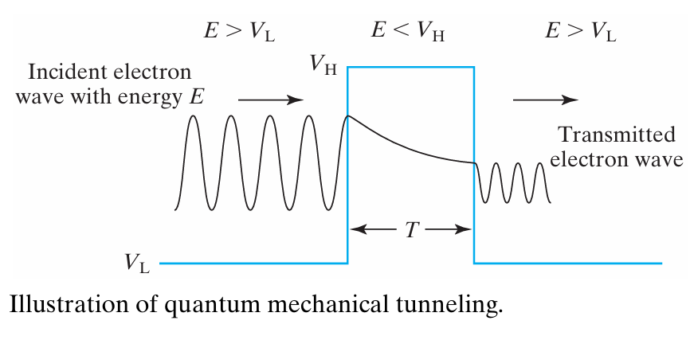
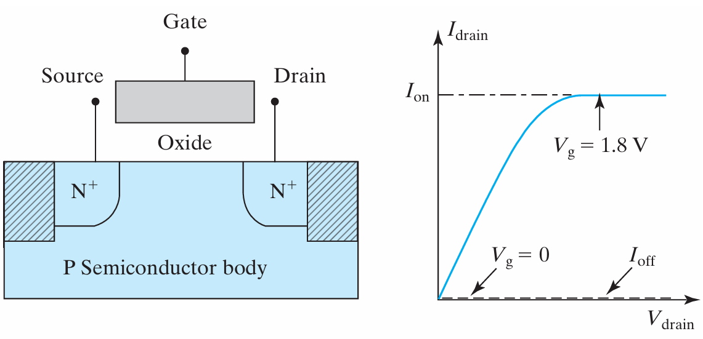
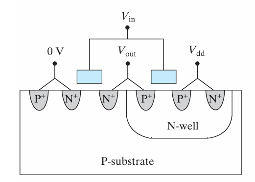
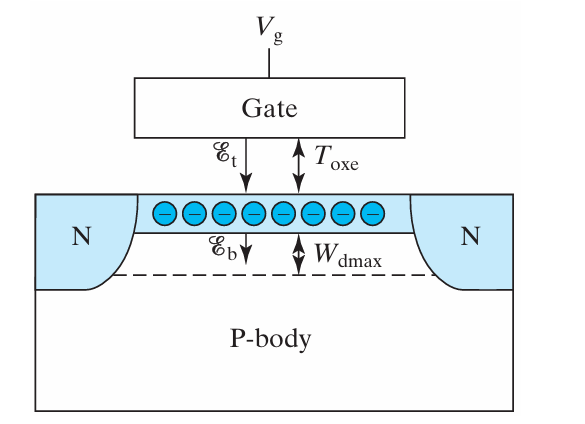
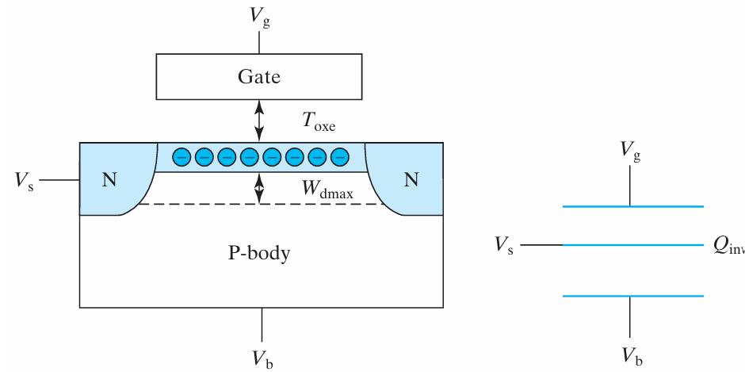
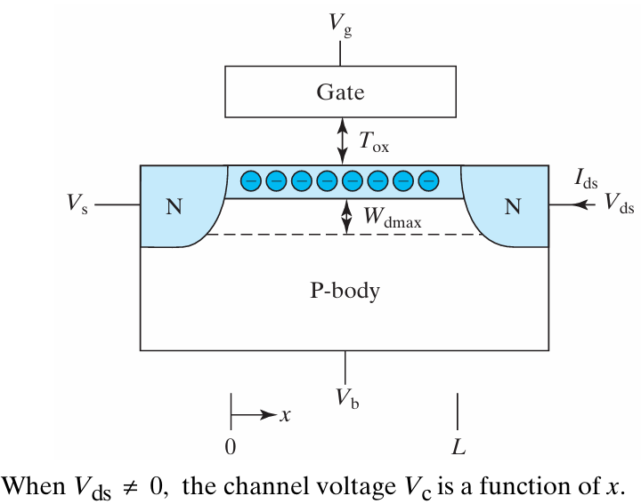
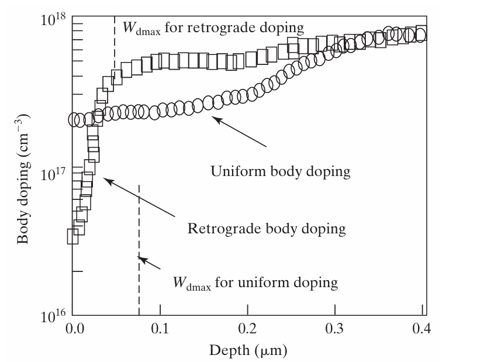

# quantum mechanical tunneling

>Electrons are traveling waves, if barrier is higher than energy, electron becomes a decaying wave.

## tunneling probabiltiy

Check [有限宽tunneling]() for quantum mechanics

**tunneling probabiltiy**

$$P =    [ 1 + \frac{V_0^2 \sinh^2(\kappa L)}{4E(V_0 - E)}    ]^{-1}$$

当 $\kappa L$ 很大时，$\sinh(\kappa L) \approx \frac{1}{2} e^{\kappa L}$
$$P \approx    [ \frac{V_0^2 \cdot (\frac{1}{2} e^{\kappa L})^2}{4E(V_0 - E)}    ]^{-1}$$
$$P \approx    [ \frac{V_0^2}{16E(V_0 - E)} e^{2\kappa L}    ]^{-1}$$
$$P \approx \frac{16E(V_0 - E)}{V_0^2} \cdot e^{-2\kappa L}$$

- $m$ is `electron effective mass`
- $L$ is  `barrier thickness`

**The tunneling probability increases exponentially with decreasing `barrier thickness`**

# Ohmic contact

>1. metal-semicondutuctor interface has `schottky barrier`
>2. Semiconductor devices are connected to each other in an integrated circuit through metal. The semiconductor to metal contacts should have sufficiently low resistance so that they do not overly degrade the device performance. These low-resistance contacts are called `ohmic contacts`. A surface layer of a heavily doped semiconductor diffusion region is converted into a silicide and a dielectric (usually SiO2) film is deposited.
>3. An important feature of all good ohmic contacts is that the semiconductor is very **heavily doped**. The `depletion layer` of the heavily doped Si is only tens of Å thin because of the high dopant concentration.

如果只是metal-semiconductor，carrier多，但width过宽

**high doping -> 高载流子浓度和窄势垒 -> 明显quantum mechanical tunneling**

$$
L \approx W_{\text{dep}}/2 = \sqrt{\varepsilon_s \phi_{Bn}/(2qN_d)}
$$

$$
P \approx e^{-H\phi_{Bn}/\sqrt{N_d}}
$$

$$
H \equiv \frac{2}{\hbar} \sqrt{\varepsilon_s m_n/q}
$$

At $V = 0$

$$
J_{S \to M} (= -J_{M \to S}) \approx \frac{1}{2} qN_d v_{\text{th}} P \approx \frac{1}{2} qN_d v_{\text{th}} e^{-H\phi_{Bn}/\sqrt{N_d}}
$$

At small  V , the net current density is
$$
J \approx    . \frac{d J_{S \to M}}{dV}    |_{V = 0} \cdot V = V \cdot \frac{1}{2} q v_{\text{thx}} H \sqrt{N_d} e^{-H \phi_{Bn} / \sqrt{N_d}}
$$

$$
R_c \equiv \frac{V}{J} = \frac{2 \cdot e^{H \phi_{Bn} / \sqrt{N_d}}}{q v_{\text{thx}} H \sqrt{N_d}}
$$

$$
\propto e^{H \phi_{Bn} / \sqrt{N_d}}
$$

$R_c$ is the **specific contact resistance** ($ \Omega \text{cm}^2$), the resistance of a 1 $cm^2$ contact. This resistance decrease **exponentially** when $L$ decrease.

# mosfet

>图中可见$N^+ , P^+$这两个连接metal和substrate的`ohmic contact`，显著降低电阻

## surface mobility
>electron or hole **mobility in the surface inversion layer** $\leftarrow$  **large** transistor current $\rightarrow$ **快速充放电**

When a small $ V_{ds}$ is applied, the drain to source current, $ I_{ds} $ is

$$
I_{ds} = W \cdot Q_{\text{inv}} \cdot v = W Q_{\text{inv}} \mu_{ns} \mathcal{E} = W Q_{\text{inv}} \mu_{ns} V_{ds} / L
$$
[check inversion for the capacitance explanation]()
$$
= W C_{\text{oxe}} (V_{gs} - V_t) \mu_{ns} V_{ds} / L
$$

- $W$ is the **channel width**. 
- $ Q_{\text{inv}} \qquad C/\text{cm}^2 $ is the inversion charge density 
- $ \mathcal{E} $ is the channel electric field
- $L$ is the **channel length**
- $ \mu_{ns} $ is the electron **surface mobility**, or the **effective mobility**.

---
### calculating mobility

$\mu_{ns}$ has been found to be a function of the average of $\mathcal{E}_b$ and $\mathcal{E}_t$
$\mathcal{E}_b$ is the field on the border of `inv layer`and `dep layer`
$\mathcal{E}_t$ is the field on the border of `oxide`and `inv layer`

Now let's figure out the two:
>$Q_{dep}$ and $Q_{inv}$ are charge density per unit area (C/cm2)

- $\mathcal{E}_t$

Apply **Gauss’s Law** to a box that encloses the depletion layer and the inversion layer.
**Using boundary condition** : $\mathcal{E} = 0$ on the border of `dep layer` and `p bulk`bcs of **electric field continuity**.

$$
\mathcal{E_t} = -(Q_{dep} + Q_{inv}) / \epsilon_s
$$

$$
= \mathcal{E_b} - Q_{inv} / \epsilon_s = \mathcal{E_b} + \frac{C_{oxe}}{\epsilon_s}(V_{gs} - V_t)
$$

$$
= \frac{C_{oxe}}{\epsilon_s}(V_{gs} - V_{fb} - \phi_{st})
$$

- $\mathcal{E_b}$

Apply Gauss’s Law to a box that encloses the depletion layer and the inversion layer.
**Using boundary condition** : $\mathcal{E} = 0$ on the border of `dep layer` and `p bulk`bcs of **electric field continuity**.
$$
\mathcal{E_b} = - Q_{dep} / \epsilon_s = \frac{C_{oxe}}{\epsilon_s}(V_t - V_{fb} - \phi_{st})
$$

- Average
$$
\frac{1}{2}(\mathcal{E_b} + \mathcal{E_t}) = \frac{C_{oxe}}{2\epsilon_s}(V_{gs} + V_t - 2V_{fb} - 2\phi_{st})
$$

$$
\approx \frac{C_{oxe}}{2\epsilon_s}(V_{gs} + V_t + 0.2    V)
$$

$$
= \frac{\epsilon_{ox}}{2\epsilon_s T_{oxe}}(V_{gs} + V_t + 0.2    V)
$$

$$
= \frac{V_{gs} + V_t + 0.2    V}{6T_{oxe}}
$$

# mosfet $V_t$
When talking about [inversion work region](), we always assume that the surface can easily get **suffient electron supply**. However, there is prerequisites, and the threshold condition (namely when the inversion work region is started) is greatly influenced by $V_{sb}$.

## predetail
**range of $V_sb$** 
>Usually, $V_{sb} < 0$, that's to say that the junction of $N^+$ source and P bulk is **never forward biased**.

**threshold condition**
>We assume that when the $E_c$ of surface fell to approach the $E_c$ of the source making conduction band gap ignorable, the surface can get suffient supply. Simply the condition can be written as
$$(E_c - E_{fp})_{surface} = (E_c - E_{fn})_{source} - qV_{sb}$$

**assumption to ease calculation**
>$$(E_f - E_v)_{bulk} = (E_c - E_{fn})_{source}$$

## derivation of $V_t$
threshold condition can be written as
$$(E_c - E_{fp})_{surface} = (E_f - E_v)_{bulk} - V_{sb}$$
the surface potential
$$(E_c - E_{fp})_{surface} = (E_c - E_f)_{bulk} - q\phi_st$$
$$\phi_st = V_{sb} + 2\phi_B \qquad \phi_B = \frac{kT}{q} \ln{\frac{N_a}{n_i}}$$
$$\phi_st = \frac{Q_{dep}^2}{2\epsilon_s qN_a}$$

### threshold voltage of $V_{gs}$
>From now on, $V_t$ refers to the threshold of **gate-source voltage**

$$V_t(V_{sb}) = V_{fb} + 2\phi_B + \frac{\sqrt{2q N_a \epsilon_s \phi_st}}{C_{ox}} $$
$$= V_{t0} + \frac{\sqrt{2q N_a \epsilon_s}}{C_{ox}} (\sqrt{V_{sb} + 2\phi_B} - \sqrt{2\phi_B})$$

# mosfet $Q_{inv}$

- 因为inversion layer载流子浓度高，可近似看成导体。中间平行板的电荷需要计算**上下个表面**电荷密度之和
- 同时，这里假设 $W_dmax$ and `body effect coeffient` 不随 $V_{sb}$ 变化
$$
Q_{inv} = -C_{oxe}(V_{gs} - V_t) + C_{dep}V_{sb}
$$
## body effect
$$= -C_{oxe}(V_{gs} - (V_t + \frac{C_{dep}}{C_{oxe}}V_{sb}))$$
$$Q_{inv} = -C_{oxe}(V_{gs} - V_t(V_{sb}))$$
$$V_t(V_{sb}) = V_{t0} + \frac{C_{dep}}{C_{oxe}}V_{sb} = V_{t0} + \alpha V_{sb}$$

$$\alpha = \frac{C_{dep}}{C_{oxe}} = 3T_{oxe}/W_{dmax}$$
The fact that $V_t$ is a function of the body bias is called the `body effect`. The body effect should be **minimized**. This can be accomplished by minimizing the Tox/Wdmax ratio. (so a `thin oxide` is desirable.) 

$\alpha$ is called the `body-effect coefficient`.

## bulk-charge effect
- channel voltage

$V_{\text{cs}}(0) = 0 \qquad V_{\text{cs}}(L) = V_{ds} \qquad L$ is the `channal length`

$$Q_{\text{inv}}(x) = -C_{\text{oxe}}(V_{\text{gs}} - V_{\text{cs}} - V_{\text{t0}} - \alpha(V_{\text{sb}} + V_{\text{cs}}))$$

$$= -C_{\text{oxe}}(V_{\text{gs}} - V_{\text{cs}} - (V_{\text{t0}} + \alpha V_{\text{sb}}) - \alpha V_{\text{cs}})$$

$$= -C_{\text{oxe}}(V_{\text{gs}} - m V_{\text{cs}} - V_{\text{t}})$$
the `bulk-charge factor`
$$m \equiv 1 + \alpha = 1 + C_{\text{dep}} / C_{\text{oxe}} = 1 + 3T_{\text{oxe}} / W_{\text{dmax}}$$

## doping type

### Retrograde body doping 
light doping in a thin surface layer and very heavy doping underneath, $W_dmax$ and `body effect coeffient` are constants. As a result, modern transistors exhibit a more or less linear relationship between $V_t$ and $V_{sb}$. 

$V_t$ obeys [the result of $Q_{inv}$](#mosfet-2)
### Uniform body doping

$W_{dmax}$ and $C_{dep}$ varies with $V_{sb}$, $V_t$ obeys [the result of $Q_{inv}$](#threshold-voltage-of)

# basic mosfet IV model

$$I_{ds} = W \cdot Q_{inv}(x) \cdot \nu = W \cdot Q_{inv} \mu_{ns} \mathcal{E}$$

$$= WC_{oxe}(V_{gs} - mV_{cs} - V_t) \mu_{ns} dV_{cs} / dx$$

$$\int_{0}^{L} I_{ds} dx = W C_{\text{oxe}} \mu_{ns} \int_{0}^{V_{ds}} (V_{gs} - m V_{cs} - V_t) dV_{cs}$$

$$I_{ds} L = W C_{\text{oxe}} \mu_{ns} \left( V_{gs} - V_t - \frac{m}{2} V_{ds} \right) V_{ds}$$

$$I_{ds} = \frac{W}{L} C_{\text{oxe}} \mu_{ns} \left( V_{gs} - V_t - \frac{m}{2} V_{ds} \right) V_{ds}$$

## drain saturation voltage
$$\frac{dI_{ds}}{dV_{ds}} = 0 = \frac{W}{L} C_{ox}\mu_{ns}(V_{gs} - V_t - mV_{ds}) \quad \text{at} \quad V_{ds} = V_{dsat}$$

$$V_{dsat} = \frac{V_{gs} - V_t}{m}$$
### saturation current
$$I_{\text{dsat}} = \frac{W}{2 \, \text{mL}} C_{\text{oxe}} \mu_{\text{ns}} (V_{\text{gs}} - V_{\text{t}})^2 $$
1. What happens at $V_{ds} = V_{dsat}$ and why does $I_{ds}$ stay constant beyond $V_{dsat}$?
>$Q_{inv}$ at the drain end of the channel, when $V_{ds} = V_{dsat}$, is zero! This disappearance of the inversion layer is called channel `pinch-off`.
>At $V_{ds} > V_{dsat}$, there exists a short, **high-field pinch-off region** where $Q_{inv} = 0$ and across which the voltage $V_{ds} - V_{dsat}$ is dropped. 

2. How can a current flow through the `pinch-off region`, which is similar to a `depletion region`? 
>The fact is that a depletion region does not stop current flow as long as there is a supply of the right carriers.