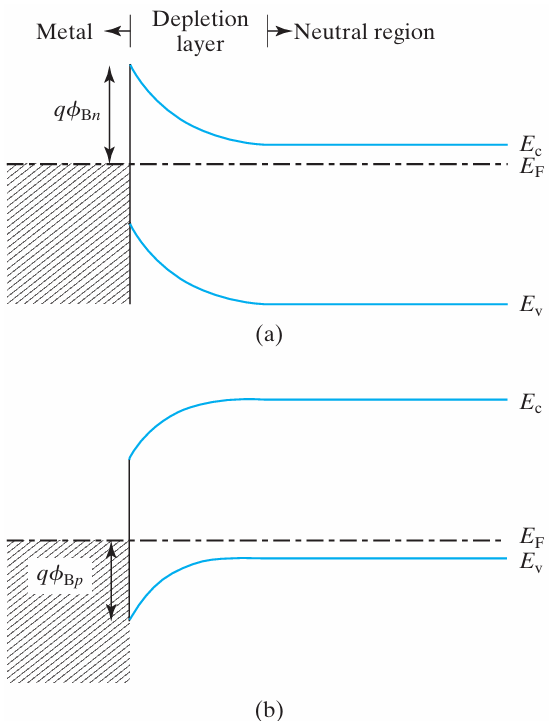
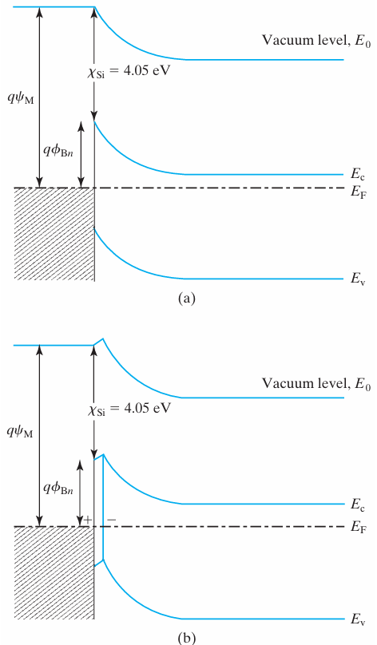
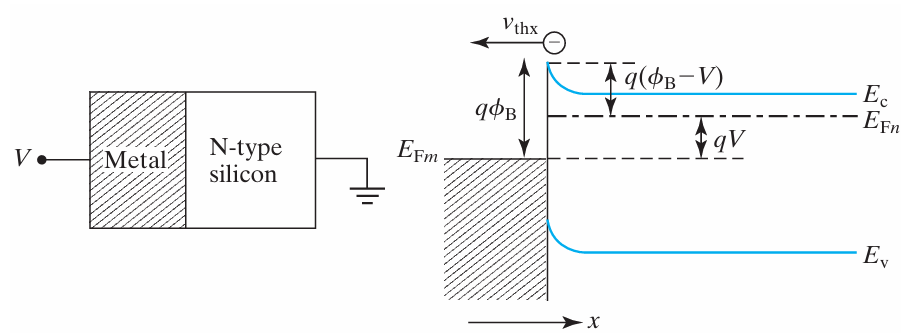
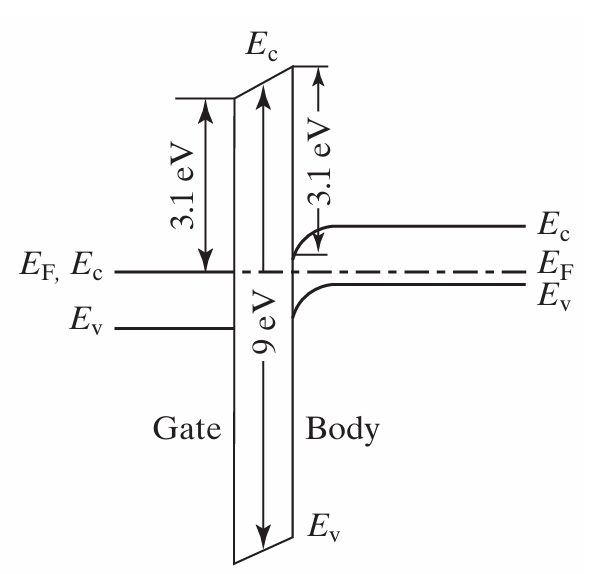
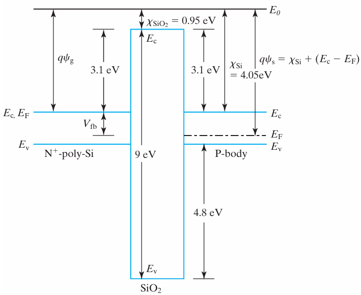
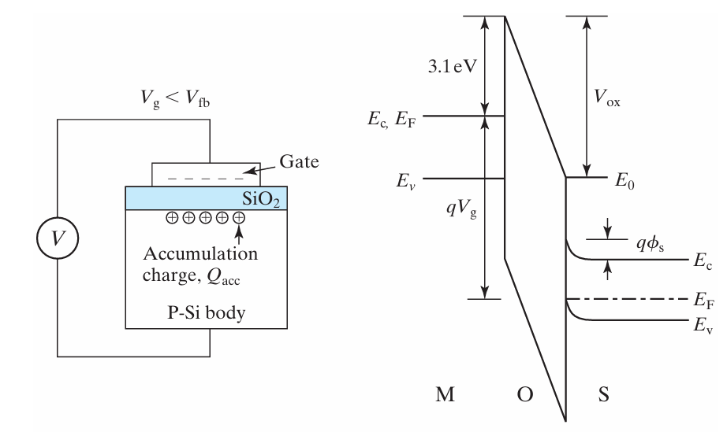
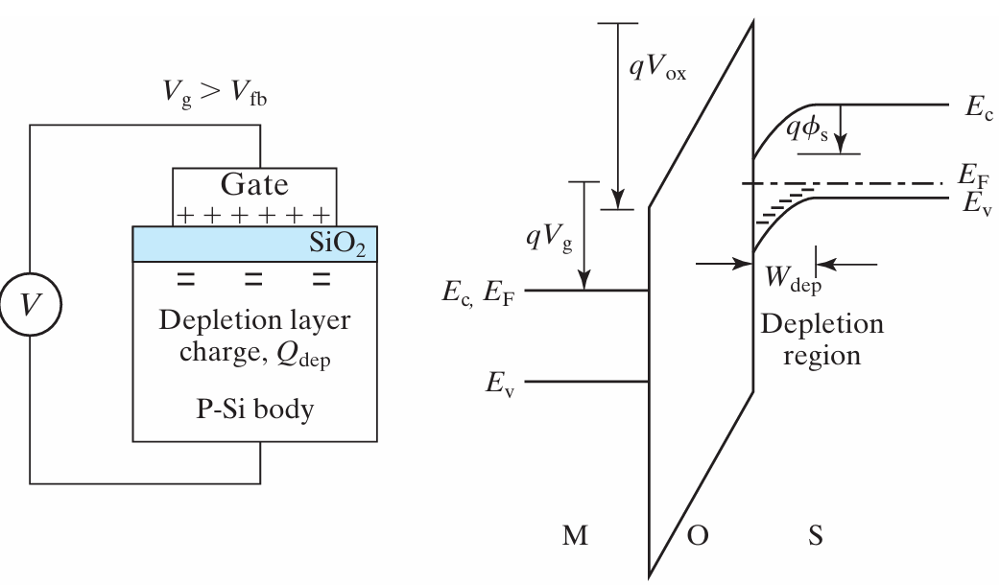
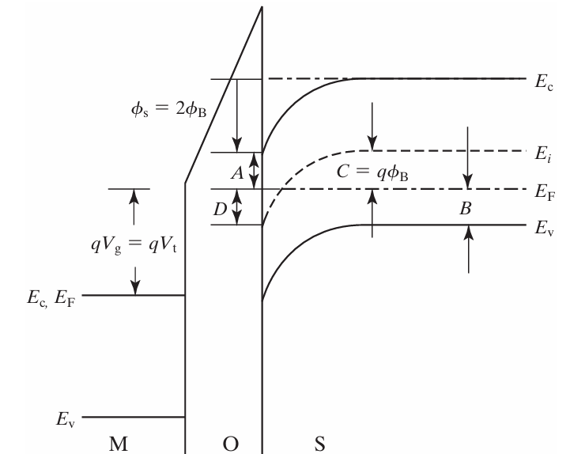
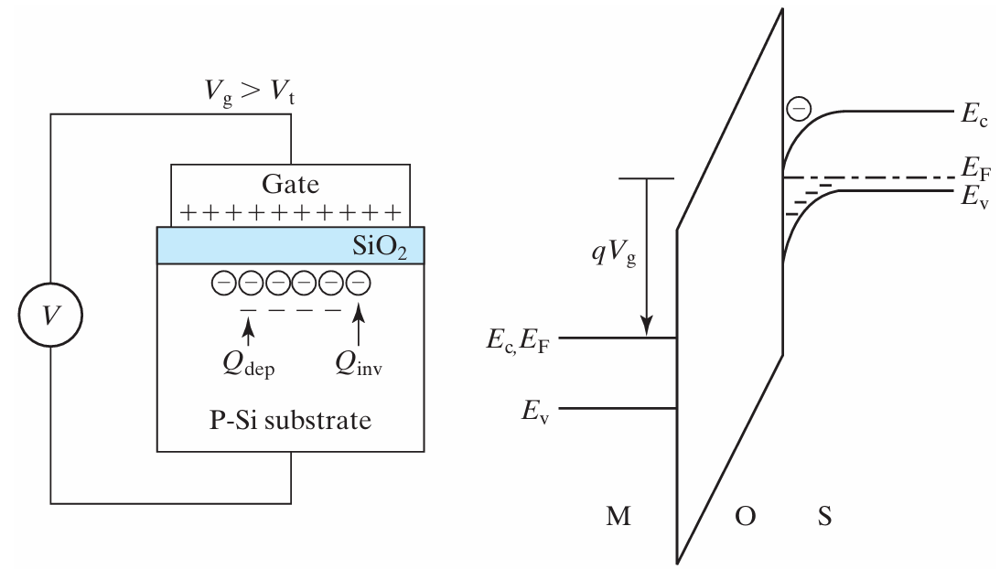
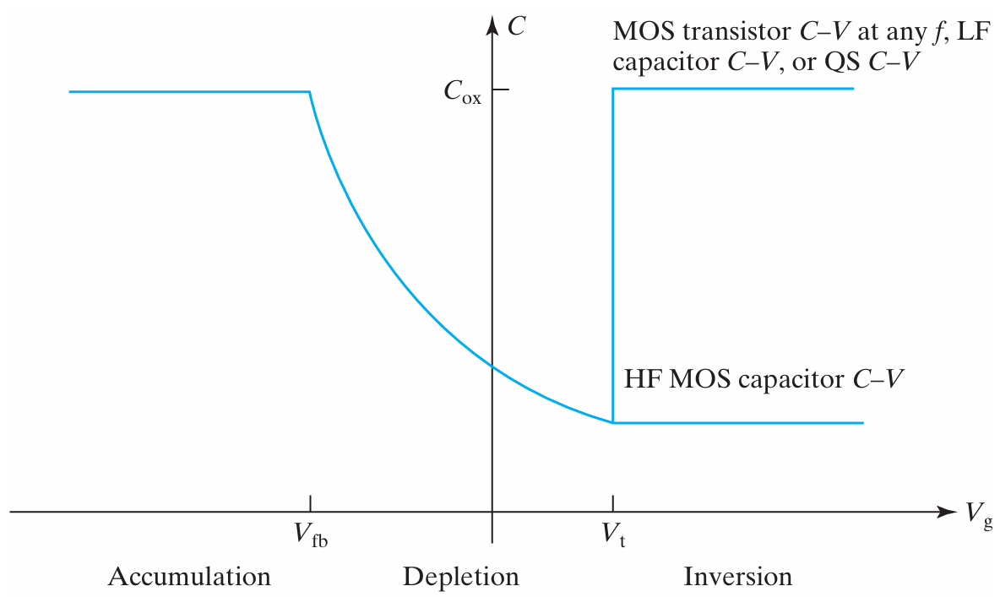

# metal-semiconductor junctions
|n type & p type | work function|
| --- | --- |
|||

## why depletion?
其本质原因在于**金属和半导体电子逸出功不同**，导致接触后为了达到热平衡，电荷发生了转移和重新分布

以 **n型半导体** 与高功函数金属接触为例：
1. **费米能级不相等**：在接触前，n型半导体的费米能级 $E_{Fs}$ 通常高于金属的费米能级 $E_{Fm}$（即半导体的功函数 $\Phi_s$ 小于金属的功函数 $\Phi_m$）。费米能级代表电子的平均化学势，意味着半导体中的电子能量比金属中的电子高
2. **电荷转移**：当两者接触时，为了达到热平衡，两边的费米能级必须对齐（即 $E_{Fs} = E_{Fm}$）。于是，半导体中高能量的电子会自发地向金属扩散
3. **留下空间电荷区（耗尽区）**：
    - 电子从半导体流向金属，并在金属表面聚集，使金属表面带负电
    - 在半导体一侧，原本提供自由电子的施主杂质（如磷、砷原子）失去了电子，变成了带正电的正离子（$N_D^+$）
    - 由于这些正离子被固定在晶格中无法移动，且该区域内的自由电子（多子）大部分已流失，因此在半导体靠近界面的一侧形成了一个缺少自由载流子的**空间电荷区**，即**耗尽区**
    - 同理，对于 **p型半导体** 与低功函数金属（$\Phi_m < \Phi_s$）接触，空穴会向金属流动（或者电子从金属流向半导体与空穴复合），在半导体一侧留下带负电的受主离子（$N_A^-$），同样形成多子（空穴）枯竭的耗尽区。

## 能量概念定义
### vaccum level
对应的是电子完全脱离固体束缚，在vaccum中的状态
When applied voltage, the vaccum level bends, bcs electron's energy varies in different points of vaccum space.

### metal work function
$$\Phi_m = E_{vac} - E_{fm}$$

### silicon electron affinity
$$\chi_s = E_{vac} - E_c$$

### silicon work function
$$\Phi_s = E_{vac} - E_{fs} = \chi_s + E_c - E_{fs}$$

### Schottky barrier
>For metal n type interface
$$\Phi_{Bn} = E_c(interface) - E_{fm}$$

## 能带变化
1. **费米能级对齐**：semi的 $E_{Fs}$ 和metal的 $E_{Fm}$ 对齐，成为一条水平线 $E_F$。因为金属是电子的海洋，从半导体注入金属的电子只是一滴水
2. **真空能级的连续性**：在接触面（忽略界面dipolar的理想情况下），真空能级 $E_{vac}$ 必须是连续的
3. **计算能级差**：
   在紧邻界面的交界处，我们同时观察两边的能级：
   * 从金属侧看，真空能级比费米能级高出 $\Phi_m$
   * 从半导体侧看，真空能级比导带底 $E_c$ 高出 $\chi_s$

由于界面处的真空能级是同一个参考点，我们可以列出能量关系：
$$\Phi_{Bn} = E_c(界面) - E_F = (E_{vac} - E_F) - (E_{vac} - E_c(界面))$$

将定义代入上式，即可得到：
$$\Phi_{Bn} = \Phi_m - \chi_s$$

对于 **p型半导体** $\Phi_{Bp}$ 则是界面处费米能级与价带顶 $E_v$ 的差值
$$\Phi_{Bp} = E_g - (\Phi_m - \chi_s)$$

## why band bending
>能带弯曲是**内建电场（静电势分布）**在能量空间上的直观反映。

$$E = -qV$$
- 静电势 $V$ 降低的地方，电子的电势能 $E$ 会**升高（能带向上弯曲）**
- 静电势 $V$ 升高的地方，电子的电势能 $E$ 会**降低（能带向下弯曲）**

1. n型半导体向上弯曲
>前提：$\Phi_m > \Phi_s$
***电场方向**：由于半导体一侧带正电，金属一侧带负电，因此在接触面形成了一个**从半导体指向金属**的内建电场。
***电势变化**：沿着电场的方向s -> m，静电势 $V$ 是逐渐**降低**的
***能带弯曲**：根据 $E = -qV$，由于界面处的静电势 $V$ 最低，电子在该处的能量 $E$ 就最高。因此，导带底 $E_c$ 和价带顶 $E_v$ 在靠近金属界面时都会**向上弯曲**

2. p型半导体向下弯曲
>前提：$\Phi_m < \Phi_s$
***电场方向**：此时，金属表面带正电，p型半导体一侧由于失去空穴而带负电（固定受主离子）。内建电场**从金属指向半导体**
***电势变化**：沿着电场方向m -> s，静电势 $V$ 逐渐降低；反过来，从半导体内部靠近金属界面时，静电势 $V$ 是逐渐**升高**的
***能带弯曲**：根据 $E = -qV$，界面处的静电势 $V$ 最高，电子在该处的能量 $E$ 就最低。因此，靠近金属界面时，能带（导带和价带）会**向下弯曲**

## thermionic emission theory

推导肖特基二极管在正向偏压 $V$ 下，流过界面的净电流密度 $J$

设 $x$ 方向为垂直于金属-半导体界面的方向。
* 电子只有在 $x$ 方向的动能大于势垒高度时，才能越过势垒。
* 势垒高度对于半导体一侧的电子来说，在偏压 $V$ 下为：
  $$E_b = q(V_{bi} - V)$$
  其中 $V_{bi}$ 是`built-in potential`，$V$ 是正向偏压。
* 电子越过势垒所需的最小 $x$ 方向速度 $v_{min}$ 满足：
  $$\frac{1}{2} m v_{min}^2 = q(V_{bi} - V)$$
  其中 $m$ 是半导体中电子的有效质量。

### $J_{s \to m}$

根据统计物理学，单位体积内、速度在 $v$ 到 $v+dv$ 之间的电子数 $dn$ 服从费米-狄拉克分布。由于势垒较高（$\Phi_{Bn} \gg kT$），可以用**麦克斯韦-玻尔兹曼分布**来近似：

$$dn = 2    ( \frac{m}{h}    )^3 \exp   ( -\frac{E - E_F}{kT}    ) dv_x dv_y dv_z$$

* $E$ 是电子的总能量，可写为导带底能量 $E_c$ 与动能之和：
  $$E = E_c + \frac{1}{2}m(v_x^2 + v_y^2 + v_z^2)$$

将 $E$ 代入 $dn$ 表达式中：

$$dn = 2 ( \frac{m}{h} )^3 \exp ( -\frac{E_c - E_F}{kT}) \exp( -\frac{m(v_x^2 + v_y^2 + v_z^2)}{2kT})  dv_x dv_y dv_z$$

电流密度是电荷量、速度和电子浓度的乘积。只有 $v_x > v_{min}$ 的电子才能贡献 $s \to m$ 的电流：

$$J_{s \to m} = q \int v_x    dn$$

将 $dn$ 代入并展开为三重积分：
$J_{s \to m} $

$$= 2q ( \frac{m}{h} )^3 \exp   ( -\frac{E_c - E_F}{kT}    ) \int_{v_\text{min}}^{\infty} v_x \exp   ( -\frac{m v_x^2}{2kT}    ) dv_x \int_{-\infty}^{\infty} \exp   ( -\frac{m v_y^2}{2kT}    ) dv_y \int_{-\infty}^{\infty} \exp   ( -\frac{m v_z^2}{2kT}    ) dv_z$$

1. **$y$ 和 $z$ 方向的积分**（高斯积分形式 $\int_{-\infty}^{\infty} e^{-ax^2} dx = \sqrt{\frac{\pi}{a}}$）：
   $$\int_{-\infty}^{\infty} \exp   ( -\frac{m v_y^2}{2kT}    ) dv_y = \sqrt{\frac{2\pi kT}{m}}$$
   同理，$z$ 方向积分也等于 $\sqrt{\frac{2\pi kT}{m}}$
   
   $$   (\sqrt{\frac{2\pi kT}{m}}   )^2 = \frac{2\pi kT}{m}$$

2. **$x$ 方向的积分**：
   令 $u = \frac{m v_x^2}{2kT}$，则 $du = \frac{m v_x}{kT} dv_x$，即 $v_x dv_x = \frac{kT}{m} du$。
   当 $v_x = v_{min}$ 时，$u_{min} = \frac{m v_{min}^2}{2kT} = \frac{q(V_{bi} - V)}{kT}$。
   
   $$\int_{v_{min}}^{\infty} v_x \exp   ( -\frac{m v_x^2}{2kT}    ) dv_x = \frac{kT}{m} \int_{u_{min}}^{\infty} e^{-u} du = \frac{kT}{m} \exp   ( -\frac{q(V_{bi} - V)}{kT}    )$$

将两部分积分结果代回 $J_{s \to m}$ 表达式：

$$J_{s \to m} = 2q    ( \frac{m}{h}    )^3 \exp   ( -\frac{E_c - E_F}{kT}    ) \cdot    [ \frac{kT}{m} \exp   ( -\frac{q(V_{bi} - V)}{kT}    )    ] \cdot    [ \frac{2\pi kT}{m*}    ]$$

$$J_{s \to m} =    ( \frac{4\pi q m k^2}{h^3}    ) T^2 \exp   ( -\frac{(E_c - E_F) + qV_{bi} - qV}{kT}    )$$

屏障高度 $\Phi_{Bn}$ 满足：
$$q\Phi_{Bn} = (E_c - E_F) + qV_{bi}$$

代入上式，并定义**Effective Richardson Constant**
$$A^* = \frac{4\pi q m k^2}{h^3}$$

$$J_{s \to m} = A^* T^2 \exp   ( -\frac{q\Phi_{Bn}}{kT}    ) \exp   ( \frac{qV}{kT}    )$$

---

### net current density $J$

总净电流密度 $J$ 是半导体流向金属的电流与金属流向半导体的电流之差：
$$J = J_{s \to m} - J_{m \to s}$$

* **确定 $J_{m \to s}$**：在平衡状态下（$V = 0$），净电流必须为零（$J = 0$）。
  因此：
  $$J_{m \to s} = J_{s \to m} (V=0) = A^* T^2 \exp   ( -\frac{q\Phi_{Bn}}{kT}    )$$
* 因为金属一侧的势垒高度 $\Phi_{Bn}$ 在外加偏压下几乎保持不变，所以 $J_{m \to s}$ 在外加电压下依然保持该常数值。

将 $J_{s \to m}$ 和 $J_{m \to s}$ 代入，得到经典的**肖特基二极管电流-电压方程**：

$$J = A^* T^2 \exp   ( -\frac{q\Phi_{Bn}}{kT}    )    [ \exp   ( \frac{qV}{kT}    ) - 1    ]$$

or
$$J = J_s    [ \exp   ( \frac{qV}{kT}    ) - 1    ]$$

 $J_s = A^* T^2 \exp   ( -\frac{q\Phi_{Bn}}{kT}    )$ 为**反向饱和电流密度**。

# MOS cap
|zero bias | flat condition |
| --- | --- |
|||

$V_{gap}$ refers to the fermi level gap btw metal and semiconductor.
$$\boxed{V_{gap} = V_{fb} + \phi_s + V_{ox}}$$

## band bending
zero bias 下，为何metal不倾斜，oxide直线倾斜，semi曲线倾斜？
>因为金属内的电子近似为“自由电子气模型”，像海平面一样，能带flat
oxide内部没有carrier，由泊松方程可知 $\mathcal{E} = Const$
semi内部的carrier分布不均，电场会变化
## flat band
`flat band` means the band in the oxide layer is flat.
`flat band voltage` eqs the difference btw gate work function and semicoductor work function 
$$V_{fb} = \psi_g - \psi_s$$
>flat band voltage is negative more often.
## surface accumulation
>more negative $V_{gap}$ than $V_{fb}$， causing charge accumulates on the oxide-semi surface.

$\phi_s$ is the **surface voltage**,is zero at Vfb and approximately zero in the accumulation region
**Hole concentration** on surface is larger than that in the bulk
$$p_s = N_a e^{{-q\phi_s}/{kT}}$$

$$V_{gap} = V_{fb} + \phi_s + V_{ox}$$
$\phi_s$ may be ignored in a first-order model since it is quite small **under surface accumulation**

### $V_{ox}$
>此处的分压按照绝缘体电容器计算

$$V_{ox} = V_{gap} - V_{fb}\qquad V_{ox} = -Q_{acc} / C_{ox}$$
$$V_{ox} = -Q_{sub} / C_{ox}$$

$C_{ox}$ is the oxide capacitance per unit area (F/cm2) and $Q_{sub}$ is the substrate charge density (C/cm2)

>- When $V_{gap}$ is positive , $Q_{sub}$ includes [depletion charge](#surface-depletion) and [inversion charge](#after-inversion)
>- Otherwise $Q_{sub}$ includes only $Q_{acc}$
---
## surface depletion

>a more positive $V_{gap}$ than $V_{fb}$ is applied.
there is now a depletion region at the surface because $E_F$ is far from both Ec and Ev

$$V_{ox} = -\frac{Q_{sub}}{C_{ox}} = -\frac{Q_{dep}}{C_{ox}} = \frac{qN_aW_{dep}}{C_{ox}} = \frac{\sqrt{qN_a^2\epsilon_s}\phi_s}{C_{ox}}$$

$$\phi_s = \frac{qN_aW_{dep}^2}{2\epsilon_s}$$

$$V_{gap} = V_{fb} + \phi_s + V_{ox} = V_{fb} + \frac{qN_aW_{dep}^2}{2\epsilon_s} + \frac{qN_aW_{dep}}{C_{ox}}$$

>**Depletion Layer**, 指半导体表面附近的区域，其中`majority carriers`被排斥，导致该区域只剩下不能移动的**donor/accepter ions** , 这些电离杂质形成了空间电荷区,电荷密度记为 $Q_{dep}$

##  THRESHOLD voltage 
>package multiple variables into one

>$V_{gap}$ increasingly more positive. **Threshold** is state when there is only depletion but approaching inversion.

The term inversion means that the surface is inverted from P type to N type, or electron rich. Threshold is often defined as the condition when the surface electron concentration, $n_s$, is equal to the `bulk doping concentration`, $N_a$. That means

$$ (E_c–E_F)_{surface} = (E_F – E_v)_{bulk}$$
$\phi_{\text{B}}$ 描述了半导体**bulk**的 $E_{\text{F}}$ 与 $E_{\text{i}}$ 的差。它反映了半导体的掺杂类型和掺杂浓度。
$$q \phi_B = \frac{E_g}{2} - (E_F - E_v)_{\text{bulk}}$$

$$= k T \ln \frac{N_v}{n_i} - k T \ln \frac{N_v}{N_a} = k T \ln \frac{N_a}{n_i}$$
### p type bulk

surface potential at the threshold condition:
$$\phi_{st} = 2 \phi_B = 2 \frac{k T}{q} \ln \frac{N_a}{n_i}$$
threshold voltage:
$$\boxed{V_t = V_{fb} + 2 \phi_B + \sqrt{\frac{2q N_a \epsilon_s 2 \phi_B}{C_{ox}}}}$$

--- 
### n type bulk

threshold voltage:
$$V_t = V_{fb} + 2 \phi_B - \sqrt{\frac{2q N_d \epsilon_s 2 \phi_B}{C_{ox}}}$$
surface potential at the threshold condition:
$$\phi_{st} = -2 \phi_B = - 2 \frac{k T}{q} \ln \frac{N_d}{n_i}$$

## INVERSION
> using the package established by threshold

> $V_{gap} > V_t$ , there is now a inversion layer, filled with inversion electron.
The `inversion charge density` is represented with $Q_{inv}$ (C/cm2)
### $\phi_s$ pinning
#### Before Inversion 
- $\phi_s < 2\phi_B$
The only charge in the semiconductor is the depletion charge $Q_{\text{dep}}$ , which only grows slowly (proportionally to $\sqrt{\phi_s}$). Because $Q_{\text{dep}}$ is relatively small, $V_{\text{ox}}$ increases slowly. Therefore, most of the increase in gate voltage ($V_{gap}$) goes directly into bending the bands further, i.e., increasing $\phi_s$.

#### After Inversion 
- $\phi_s \ge 2\phi_B$
Once $\phi_s$ reaches $2\phi_B$, the `inversion layer` forms. Now, if $V_{gap}$ increase  further:
1. If $\phi_s$ were to increase even slightly (e.g., by $0.1\text{ V}$), the exponential rule dictates that $Q_{\text{inv}}$ would increase massively.
2. This massive surge in $Q_{\text{inv}}$ requires a correspondingly massive increase in the oxide voltage drop ($V_{\text{ox}} = Q_{\text{inv}}/C_{\text{ox}}$).
3. Since $V_{gap} = V_{\text{fb}} + V_{\text{ox}} + \phi_s$, **almost all of the newly applied gate voltage is "soaked up" by the oxide ($V_{\text{ox}}$)** to support this massive sheet of inversion charge.
4. As a result, there is virtually no leftover voltage from the gate to further increase the surface potential $\phi_s$. And depletion layer width reached its maximum value
$$W_{dmax} = \sqrt{\frac{2\epsilon_s 2\phi_B}{qN_a}}$$
---
$$V_{\text{gap}} = V_{\text{fb}} + 2\phi_{\text{B}} - \frac{Q_{\text{dep}}}{C_{\text{ox}}} - \frac{Q_{\text{inv}}}{C_{\text{ox}}} = V_{\text{fb}} + 2\phi_{\text{B}} + \frac{\sqrt{q N_{\text{a}} 2\varepsilon_{\text{s}} 2\phi_{\text{B}}}}{C_{\text{ox}}} - \frac{Q_{\text{inv}}}{C_{\text{ox}}}$$

引入 $V_{\text{t}}$ 后的简化公式
$$V_{\text{gap}} = V_{\text{t}} - \frac{Q_{\text{inv}}}{C_{\text{ox}}}$$

[ expression of $V_t$](#p-type-bulk)

> **Inversion Layer**, 当栅压超过阈值电压 $V_{th}$ 时，由于能带弯曲足够大，费米能级靠近导带（或价带），导致表面吸引了大量的**少数载流子**，形成了一个`shallow trench`

反型层电荷密度 $Q_{\text{inv}}$ 的最终表达

$$\therefore \quad \boxed{Q_{\text{inv}} = -C_{\text{ox}}(V_{\text{gap}} - V_{\text{t}})}$$

---

### layers
1. **Oxide**：作为电介质，通过电压降分配传递栅极电场。
2. **inversion layer（电子层）**：紧贴氧化层，其电荷密度随`surface potential`指数级增长, very thin. 当$V_{gap} > V_t$，$V_{gap}$ 持续增加，引起gate charge 增加. Gate增加的每一份电荷增量（$\Delta Q_g$），都会立即被进入`inversion layer`的负电荷（$\Delta Q_{inv} = -\Delta Q_g$）完全抵消。根据**高斯定理**，取一个围住栅极、inversion layer的高斯面，$V_{gap}$增加对`depletion layer`电场的影响可以忽略
3. **depletion layer（离子层）**：由于`inversion layer`截获了所有栅极电荷增量，穿透进入该区域的净电荷量保持不变，导致耗尽层电场分布不再改变。

## MOS C–V CHARACTERISTICS

The capacitance in the MOS theory is always the `small-signal capacitance`
$$C \equiv \frac{dQ_g}{dV_{gap}} = - \frac{dQ_sub}{dV_{gap}}$$
>The negative sign arises from the fact that $V_{gap} and Q_sub$ are taken from different plates.

### 3 work regions
1. in `acc region`, $C = C_{ox}$
2. in `dep region`, 
$$C_{\text{dep}} = \frac{\varepsilon_s}{W_{\text{dep}}}$$
$$\frac{1}{C} = \frac{1}{C_{\text{ox}}} + \frac{1}{C_{\text{dep}}}$$
$$\frac{1}{C} = \sqrt{\frac{1}{C_{\text{ox}}^2} + \frac{2(V_{gap} - V_{\text{fb}})}{qN_a\varepsilon_s}}$$
3. in `inv region`, 
- **if the device is MOS transistor** `inversion layer` can get suffient **electron supply** becomes the bottom electrode,  $C = C_{ox}$
- if **insuffient electron supply** , things becomes similar to `dep region`. However, due to $W_{dep}$ has a maximum $W_{dmax}$, the capcitance saturates when $V_{gap}$ reaches $V_t$.
**MOS transistor/cap C–V**

