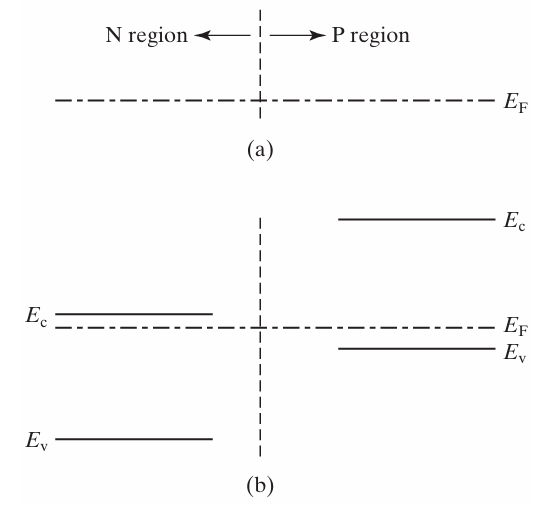
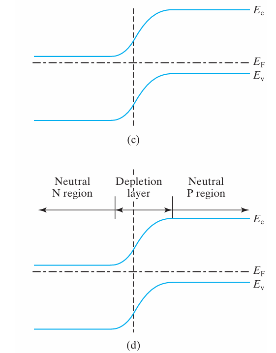
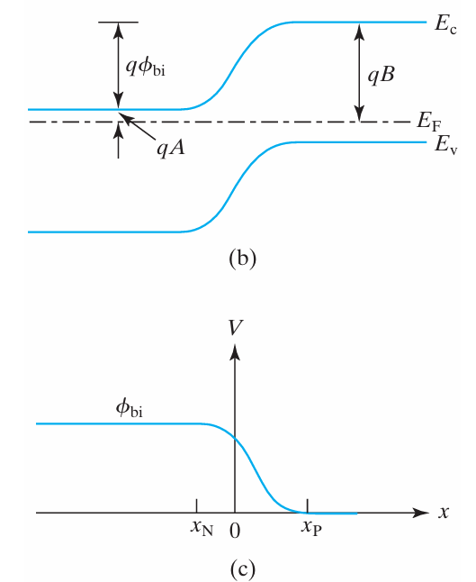
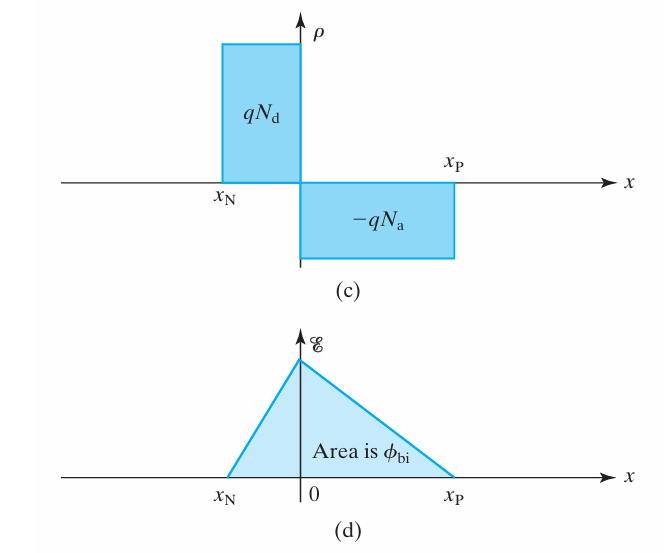
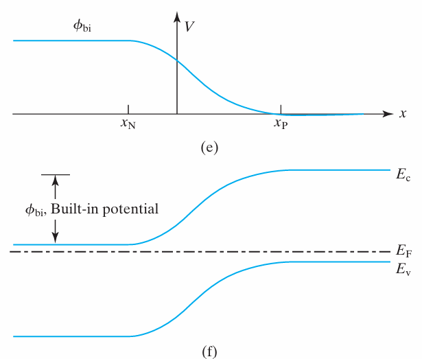
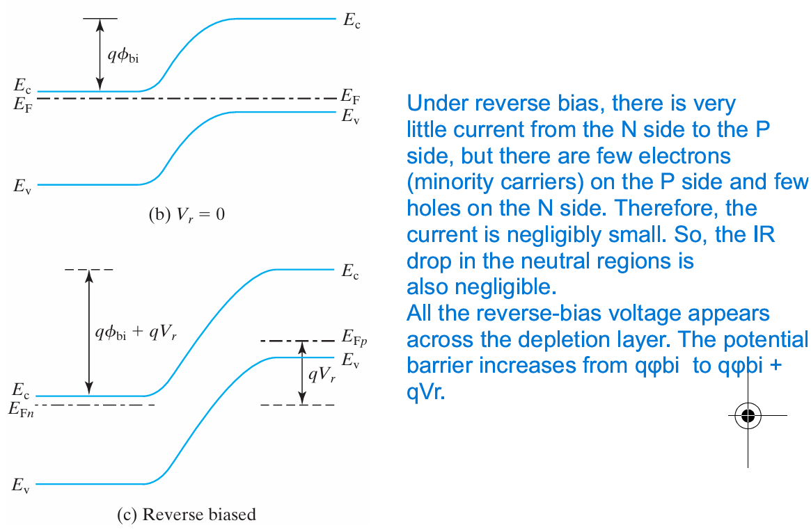
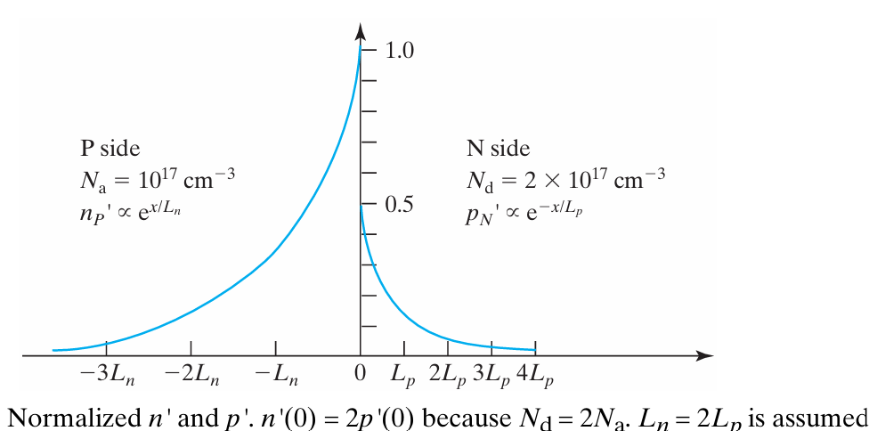

# Quasi-Equilibrium & Quasi-Fermi Levels

> 1. **核心思想**：非热平衡下 $np \neq n_i^2$，单一费米能级 $E_F$ 失效。准费米能级（$E_{Fn}, E_{Fp}$）是热力学电化学势在微观量子统计上的体现，它完美统一了**电场漂移**与**浓度扩散**。
> 2. 此时有`excess carrier concentration`，假设满足小注入条件，即过剩载流子相比多子可以忽略不计

## why“准”平衡？

非热平衡状态（外加电压或光照）下，系统内部存在两种**数量级相差极大的微观弛豫时间**：

1. **带内弛豫极快（$\sim 10^{-13}\text{ s}$，飞秒级）**：
   电子与电子之间、空穴与空穴通过频繁的热碰撞交换能量极快。因此，**导带内的所有电子自己达成了热平衡**，**价带内的所有空穴自己也达成了热平衡**。
2. **带间复合极慢（$\sim 10^{-6} \text{ to } 10^{-9}\text{ s}$，微秒级）**：
   导带电子跨越禁带与价带空穴复合的速度相对极慢，导致电子系统与空穴系统之间**失去了整体平衡**。

> **结论**：导带和价带各自内部达到了热平衡，但两带之间未平衡，这种状态称为**准平衡状态（Quasi-Equilibrium）**。

---
## Quasi-Fermi Level属于“谁”？

### 属于carrier，而非area
* **$E_{Fn}(x)$（电子准费米能级）**：描述全器件中**导带电子**的统计分布/电化学势。
* **$E_{Fp}(x)$（空穴准费米能级）**：描述全器件中**价带空穴**的统计分布/电化学势。
* **物理事实**：PN 结的任意位置 $x$（无论是 P 区、N 区还是耗尽区），**都同时存在 $E_{Fn}(x)$ 和 $E_{Fp}(x)$**。

### $E_{fp}$ & $1 - f(E)$ 自洽
* **空穴占据概率公式**
$$f_p(E) = 1 - f(E) = \frac{1}{e^{(E_{Fp} - E)/kT} + 1}$$
* **逻辑统一**：$1 - f(E)$ 是概率计算法则；$E_{Fp}$ 是非平衡下带入法则中的特定能级参数，两者完全自洽。
---

## 不同区域的Quasi-Fermi Level

### 中性区：多子锁定
在小注入条件下，即`excess carrier concentration` is negligible compared to $n_0 p_0$
所以，即使在非平衡下，若完全电离，多子浓度仍然近似等于掺杂浓度（$n \approx N_d$ 或 $p \approx N_a$）
* **N 区中性区**：$n \approx N_d \implies (E_c - E_{Fn}) = kT \ln \frac{N_c}{N_d} = \text{常数}$。
* **P 区中性区**：$p \approx N_a \implies (E_{Fp} - E_v) = kT \ln \frac{N_v}{N_a} = \text{常数}$。

> **物理图像**：在低注入中性区，**多子准费米能级与能带（$E_c, E_v$）绑定为硬木板整体平移**，两者相对位置死死锁定，绝不相对移动。

### 耗尽区：fermi level分裂且平直
正向偏置下，耗尽层极其狭窄（$\sim 1\mu\text{m}$）且注入了大量载流子，对载流子传输阻力极小。
根据准费米能级斜率公式：
$$\frac{dE_{Fn}}{dx} = \frac{J_n}{\mu_n n(x)} \approx 0 \implies \Delta E_{Fn} \approx 10^{-15}\text{ eV} \approx 0$$
> **物理图像**：在正偏耗尽区内部，**准费米能级像一条平直的剑直接穿过耗尽层**（几乎没有降落/斜率）。因此，耗尽区内部两者的间距全区恒定，且严格等于外偏压：
$$E_{Fn}(x) - E_{Fp}(x) = q V \quad (\text{耗尽区内部})$$
Let us assume that $E_{fn}$ remains constant through $x_P$ because the depletion layer is narrow.
---

## 为何费米能级是化学势

传统的电流密度由两项组成：漂移电流(电场拉扯) + 扩散电流(浓度挤压)
$$J_n = q n \mu_n \mathcal{E} + q D_n \nabla n$$

代入电子浓度非平衡公式 $n(x) = n_i e^{(E_{Fn} - E_i)/kT}$ 与爱因斯坦关系式（$D_n = \mu_n \frac{kT}{q}$）化简，**漂移与扩散两项合并为单项**：

$$J_n = \mu_n n \nabla E_{Fn}$$
$$J_p = \mu_p p \nabla E_{Fp}$$

> **物理本质**：
> 1. **准费米能级的梯度 $\nabla E_F$ 是推动总电流的唯一真正热力学驱动力**（包含了电势能与化学势能）。
> 2. 若某区域 $\nabla E_{Fn} = 0$，则该区域电子的**净电流严格为零**（漂移与扩散完美抵消）。

| 维度 | 热平衡状态（Thermal Equilibrium） | 非平衡状态（Non-Equilibrium） |
| :--- | :--- | :--- |
| **费米能级关系** | 全器件统一：$E_{Fn}(x) = E_{Fp}(x) = E_F$ | 两带分裂：$E_{Fn}(x) \neq E_{Fp}(x)$ |
| **载流子积 $np$** | 严格等于常数：$np = n_i^2$ | 偏离平衡：$np = n_i^2 e^{(E_{Fn} - E_{Fp})/kT}$ |
| **驱动力** | $\nabla E_F = 0 \implies J_{total} = 0$ | $\nabla E_{Fn} \neq 0 \implies J_n \neq 0$ |
| **偏离度物理意义** | 无偏离 | $(E_{Fn} - E_{Fp})$ 直接量化了系统偏离热平衡的程度 |

# Poisson's Equation
- Derived from `Gauss's law`

$$\boxed{\frac{d^2V}{{dx}^2} = -\frac{\rho}{\epsilon_s}}$$

# PN junction under thermal equilibrium

## model & band diagram
We use a `simplified model` : **step junction / abrupt junction**
The depletion layer is btw the p-side and n-side.

>At equilibrium or zero biased, only one horizon fermi level

|Intermediate steps of constructing the energy band diagram of a PN junction |  The complete band diagram. |
|---|---|
|||

---

### why depletion?
The term depletion layer means that the layer is depleted of electrons and holes. 
Bcs holes **diffuse** from p-side to n-side, and similarly electrons
- Results

Mobile carriers are **depleted** in the depletion layer.
$$\Downarrow$$
The ionized dopants ${N_a}^-$ near p-side, ${N}_d^+$ near n-side are no longer compensated by mobile carriers.
$$\Downarrow$$
This results in a **net space charge** in the depletion region, which creates a `built-in electric field` opposite to the `diffusion current`.

---

### built-in potential
- `built-in potential`定义为**热平衡下** N区与P区的电势差，即 $V_{bi} = \phi_n - \phi_p$, 是温度和doping决定的固有属性，不受外界影响

- 基于载流子电流平衡推导
$$J_n = q n \mu_n \mathcal{E} + q D_n \nabla n$$

在热平衡状态下，$J_n = \mu_n n \nabla E_{Fn} = 0$
- 引入电势与爱因斯坦关系式
电场强度 $E(x)$ 与电势 $\phi(x)$ 的关系为：
$$E(x) = -\frac{d\phi(x)}{dx}$$

根据爱因斯坦关系式，迁移率和扩散系数满足：
$$\frac{D_p}{\mu_p} = \frac{k_B T}{q} = V_t$$
（其中 $V_t$ 为热电压，常温下约等于 $26\text{ mV}$，$k_B$ 为玻尔兹曼常数，$T$ 为绝对温度）。

将上述两个关系代入平衡方程：
$$q \mu_p p    (-\frac{d\phi}{dx}   ) - q D_p \frac{dp}{dx} = 0$$

$$-\frac{d\phi}{dx} = \frac{D_p}{\mu_p} \frac{1}{p} \frac{dp}{dx}$$
$$-d\phi = V_t \frac{dp}{p}$$

在PN结的空间电荷区两端进行积分：
   在P区边界（$x = -x_p$），电势为 $\phi_p$，空穴浓度为空穴多子浓度 $p_p \approx N_A$（受主掺杂浓度）。
   在N区边界（$x = x_n$），电势为 $\phi_n$，空穴浓度为空穴少子浓度 $p_n \approx \frac{n_i^2}{N_D}$（其中 $n_i$ 为本征载流子浓度，$N_D$ 为施主掺杂浓度）。

积分式为：
$$\int_{\phi_p}^{\phi_n} -d\phi = V_t \int_{p_p}^{p_n} \frac{1}{p} dp$$

计算积分：
$$-(\phi_n - \phi_p) = V_t \ln   (\frac{p_n}{p_p}   )$$
$$V_{bi} = V_t \ln   (\frac{p_p}{p_n}   )$$

- 代入掺杂浓度
将 $p_p \approx N_A$ 和 $p_n \approx \frac{n_i^2}{N_D}$ 代入上式：
$$V_{bi} = V_t \ln{\frac{N_A}{\frac{n_i^2}{N_D}}} = V_t \ln{\frac{N_A N_D}{n_i^2}}$$

$$\boxed{V_{bi} = \frac{k_B T}{q} \ln{\frac{N_A N_D}{n_i^2}}}$$

---

### Field and Potential in Depletion Layer 

>N on Left, P on Right
$$
\rho(x) = 
\begin{cases} 
0, & x < -x_n \quad \text{(neutral N)} \\\\
+q N_d, & -x_n \le x < 0 \quad \text{(N区耗尽层，电荷来自 donor ion)} \\\\
-q N_a, & 0 < x \le x_p \quad \text{(P区耗尽层，电荷来自 acceptor ion)} \\\\
0, & x > x_p \quad \text{(neutral P)}
\end{cases}
$$

#### 电场 $\mathcal{E}(x)$ 的推导

$$
\frac{d\mathcal{E}(x)}{dx} = \frac{\rho(x)}{\epsilon}
$$

> 泊松方程 + Boundary condition: $E(-x_n) = E(x_p) = 0$

- **N 区耗尽层（$-x_n \le x < 0$）**
对 $\frac{d\mathcal{E}}{dx} = \frac{q N_d}{\epsilon}$ 进行积分，利用边界条件 $E(-x_n) = 0$：
$$
\mathcal{E}(x) = \int_{-x_n}^{x} \frac{q N_d}{\epsilon} dx' = \frac{q N_d}{\epsilon} (x + x_n)
$$

- **P 区耗尽层（$0 < x \le x_p$）**
对 $\frac{d\mathcal{E}}{dx} = -\frac{q N_a}{\epsilon}$ 进行积分，利用边界条件 $E(x_p) = 0$：
$$
\mathcal{E}(x) = -\int_{x}^{x_p}    (-\frac{q N_a}{\epsilon}   ) dx' = \frac{q N_a}{\epsilon} (x_p - x)
$$

- **界面处电场的连续性与最大电场 $E_{max}$**
在 $x = 0$ 处，电场必须连续：
$$
\mathcal{E}(0^-) = \frac{q N_d x_n}{\epsilon}\qquad\mathcal{E}(0^+) = \frac{q N_a x_p}{\epsilon}
$$
所以 $N_d x_n = N_a x_p$（电中性条件）。电场在 $x=0$ 处取得最大值（方向指向 $+x$ 方向，即从 N 区指向 P 区）：
$$
\mathcal{E}_{max} = E(0) = \frac{q N_d x_n}{\epsilon} = \frac{q N_a x_p}{\epsilon}
$$

#### 电势 $V(x)$ 的推导

$$
\mathcal{E}(x) = -\frac{dV(x)}{dx} \implies V(x) = -\int E(x) dx
$$

> **参考电势设置**：习惯上设 P 区中性区的电势为零点，即 $V(x_p) = 0$。

- **P 区耗尽层（$0 < x \le x_p$）**
从 $x$ 积分到 $x_p$：
$$
V(x_p) - V(x) = -\int_{x}^{x_p} E(x') dx' \implies V(x) = \int_{x}^{x_p} \frac{q N_a}{\epsilon} (x_p - x') dx'
$$
$$
V(x) = \frac{q N_a}{2\epsilon} (x_p - x)^2
$$
在交界面 $x = 0$ 处的电势为：
$$
V(0) = \frac{q N_a}{2\epsilon} x_p^2
$$

- **N 区耗尽层（$-x_n \le x < 0$）**
从 $x$ 积分到 $0$：
$$
V(0) - V(x) = -\int_{x}^{0} E(x') dx' \implies V(x) = V(0) + \int_{x}^{0} \frac{q N_d}{\epsilon} (x' + x_n) dx'
$$
$$
V(x) = \frac{q N_a}{2\epsilon} x_p^2 + \frac{q N_d}{\epsilon}    ( -x_n x - \frac{x^2}{2}    )
$$

#### $V_{bi}$ 与width $W$

**Built-in Potential, $V_{bi}$**：

$$
V_{bi} = \frac{q N_a}{2\epsilon} x_p^2 + \frac{q N_d}{2\epsilon} x_n^2
$$

利用电中性条件 $x_p = \frac{N_d}{N_a} x_n$，可将 $V_{bi}$ 简化为仅由 $x_n$ 或 $x_p$ 表示：
$$
\boxed{V_{bi} = \frac{q}{2\epsilon} \frac{N_d (N_a + N_d)}{N_a} x_n^2}
$$

由此可以解出 **耗尽层宽度**：
$$
x_n = \sqrt{\frac{2\epsilon V_{bi}}{q} \frac{N_a}{N_d(N_a + N_d)}}\qquad x_p = \sqrt{\frac{2\epsilon V_{bi}}{q} \frac{N_d}{N_a(N_a + N_d)}}
$$
$$
W = x_p + x_n = \sqrt{\frac{2\epsilon V_{bi}}{q}    ( \frac{1}{N_a} + \frac{1}{N_d}    )}
$$

> 由此可见,**热平衡下**，掺杂（doping）决定 `built-in potential` 和耗尽层宽度 $W$；
>The depletion-layer width is determined by the **lighter doping concentration**.
$$\boxed{W =  \sqrt{\frac{2\epsilon V_{bi}}{q N}}}\qquad  \frac{1}{N} = \frac{1}{N_a} + \frac{1}{N_d}$$ 

|Charge and field|potential and energy band|
|---|---|
| ||

---

### reverse bias下的barrier和width

>equilibrium condition is broken
$$W =  \sqrt{\frac{2\epsilon (V_{bi} + V_r)}{q N}} = \sqrt{\frac{2\epsilon \times potential barrier}{q N}}$$
1. 这里改变的是`potential barrier(势垒)`,而不是`built-in potential`.所以更普遍地,width是`势垒`和doping决定的.`势垒`是doping和bias决定的.应该认为bias和doping是**决定width的本质因素**.
2. 这里认为因为耗尽区载流子很少，所以反向击穿电流很小，可以忽略

---

### Capacitance
此处的电容定义是微分电容$C = \frac{dQ}{dV}$,电容不是定值，会随着电压变化。下面的结论类似平行板电容

$$C_{dep} = \frac{\epsilon_s A}{W_{dep}}$$
---

## Junction breakdown
>1. **有电流即击穿**
   A reverse-biased PN junction conducts negligibly small current. This is true until a critical reverse bias is reached and junction breakdown occurs.
>2. **击穿因为电场强度**
   Junction breakdown occurs when the peak electric field in the PN junction reaches a critical value.

### Peak electric field
$$
\mathcal{E}_{max} = E(0) = \frac{q N_d x_n}{\epsilon}\qquad V_{bi} = \frac{q}{2\epsilon} \frac{N_d (N_a + N_d)}{N_a} x_n^2
$$
When $\mathcal{E}_{max}$ reaches some critical value, $\mathcal{E}_{crit}$, `breakdown voltage` can be calculated
$$ V_{break}  = \frac{\epsilon \cdot\mathcal{E}_{crit}^2}{2qN} - V_{bi}$$

---

# forward bias

>**minority carrier injection**
`injection`的意思就是：多数载流子越过势垒，扩散到对方区域，成为对方区域的非平衡少数载流子的过程
a forward bias of V reduces the barrier height from φbi to φbi–V. This reduces the $\mathcal{E}$ and upsets the balance between diffusion and drift that exists at zero bias. Electrons can now diffuse from the N side into the P side. Similarly, holes are injected from the P side into the N side. 

## quasi-equilibrium boundary condition
- 在depletion layer，我们有`肖克利假设`：由于depletion layer极窄且几乎没有载流子，所以载流子通过时间极短，远远小于 $\tau$ ，所以耗尽层内不考虑`recombination`

- 在中性区，不能忽略`recombination`,所以不能直接使用这节推出的东西，需要考虑[连续性方程](#continuity-equation)

- 在中性区和depletion layer的边界，由于多子浓度一致，且可以使用`肖克利假设`，所以下面很容易算出少子浓度，边界处的浓度可以作为`continuity equation`这个微分方程的边界条件

On the N side, \( E_c - E_{Fn} \) is of course determined by \( N_d \)  Check [predetail](#不同区域的quasi-fermi-level) to understand equations below.

$$
n(x_p) = N_c e^{-(E_c - E_{Fn})/kT} 
= N_c e^{-(E_c - E_{Fp})/kT} e^{(E_{Fn} - E_{Fp})/kT}
$$

$$
= n_{p0} e^{(E_{Fn} - E_{Fp})/kT} = n_{p0} e^{qV/kT} 
$$

\( n_{p0} \) is the **equilibrium** `denoted by subscript 0` electron concentration of the **P region** `denoted by the subscript P`, simply \( n_i^2/N_a \). The minority carrier density has been raised by \( e^{qV/kT} \).

A similar equation may be derived for \( p(x_N) \).Now we concluded **quasi-equilibrium boundary condition** or the **Shockley boundary condition**.

$$
\boxed{
\begin{aligned}
   n(x_p) = n_{p0} e^{qV/kT} &= \frac{n_i^2}{N_a} e^{qV/kT} \\
   p(x_N) = p_{N0} e^{qV/kT} &= \frac{n_i^2}{N_d} e^{qV/kT}
\end{aligned}
}
$$

### excess minority carrier
$$
\boxed{
\begin{aligned}
   n'(x_p) = n(x_p) - n_{p0}  &= \frac{n_i^2}{N_a} (e^{qV/kT} - 1)\\
   p'(x_N) = p(x_N) - p_{N0}  &= \frac{n_i^2}{N_d} (e^{qV/kT} - 1)
\end{aligned}
}
$$

---

## Continuity equation
**neutral area**
这部分excess carrier是空穴流入，流出，复合动态平衡的结果
>To determine the minority carrier densities in the interiors of the neutral N and P regions 
In steady state, the number of holes flowing into the box per second = number of holes flowing out of the box per second + number of holes recombining in the box per second

$$
\frac{dJ_p}{dx} = q \frac{p'}{\tau} 
$$
$p'$ is excess hole concentration, τ is the recombination lifetime of the carriers.
This equation is valid for **both the majority and minority** carriers. 
>However, it is particularly easy to apply it to the minority carriers. The **minority carrier current** (but not the majority carrier current) is **dominated by diffusion** and the drift component can be ignored.
- proof
$$J_p = -qD_p\frac{dp}{dx} + q\mu_p p\mathcal{E}$$

*For* minority, $p$ is small, $\mathcal{E}$ is negligible in neutral area, $\nabla p$ is huge.
*For* majority, $p = N_a$, drift component cannot be ignored.  

### excess concentration contributes to net recombination
因为在半导体中，**载流子的“产生”和“复合”是一个动态平衡的过程**。我们只关心打破平衡后发生的**净复合（Net Recombination）**

- 热平衡状态
即使没有外加电压、没有光照（处于热平衡状态），半导体内部也时刻在发生着两件事：
1. **热产生**（Thermal Generation, $G_0$）：热运动不断让电子脱离束缚，产生新的空穴。
2. **热复合**（Thermal Recombination, $R_0$）：原有的空穴和电子相遇并消失。

在热平衡时，这两者的速度是**完全相等**的，即：
$$R_0 = G_0$$
此时，虽然有空穴在不断死亡（复合），但也有同等数量的空穴在出生（产生）。因此，**整体上空穴的浓度保持恒定，电流不会发生任何变化**。

- 非平衡状态
当我们加电压后，总空穴浓度变为了 $p = p_0 + p'$。

由于空穴变多了，它们遇到电子并发生复合的概率也随之变大：
* **总复合率** 变为了：$R = \frac{p}{\tau} = \frac{p_0 + p'}{\tau}$
* 而**热产生率** $G_0$ 依然保持不变：$G_0 = \frac{p_0}{\tau}$

此时，单位时间内**净损失**的空穴数（即净复合率 $U$）等于“总共死掉的”减去“新产生的”：
$$U = R - G_0 = \frac{p_0 + p'}{\tau} - \frac{p_0}{\tau} = \frac{p'}{\tau}$$

$$
qD_p \frac{d^2p}{dx^2} = q \frac{p'}{\tau_p} 
$$

$$
\boxed{\frac{d^2p'}{dx^2} = \frac{p'}{D_p \tau_p} = \frac{p'}{L_p^2} \qquad L_p \equiv \sqrt{D_p \tau_p}}
$$
$$
\boxed{\frac{d^2n'}{dx^2} = \frac{n'}{D_n \tau_n} = \frac{n'}{L_n^2} \qquad L_n \equiv \sqrt{D_n \tau_n}}
$$
$L_p , L_n$ are called diffusion lengths.

### calculate excess minority carrier concentration
The minority carriers in the interior of neutral area by solving

$$
\frac{d^2 p'}{dx^2} = \frac{p'}{L_p^2}
$$

for the boundary conditions

$$
p'(\infty) = 0
$$

$$
p'(x_N) = p_{N0}(e^{qV/kT} - 1)
$$

The general solution

$$
p'(x) = Ae^{x/L_p} + Be^{-x/L_p}
$$

The first boundary condition demands \(A = 0\). The second determines \(B\) and leads to

$$
p'(x) = p_{N0}(e^{qV/kT} - 1)e^{-(x-x_N)/L_p}, \quad x > x_N
$$

Similarly, on the P side,

$$
n'(x) = n_{P0}(e^{qV/kT} - 1)e^{(x-x_P)/L_n}, \quad x < x_P
$$

From the depletion-layer edges, the injected minority carriers move outward by diffusion. As they diffuse, their densities are reduced due to recombination, thus creating the exponentially decaying density profiles. Beyond a few diffusion lengths from the junction, p' have decayed to negligible values

## ideal PN diode IV 特性
N side minority:
$$
J_{pN} = -qD_p \frac{dp'(x)}{dx} = q \frac{D_p}{L_p} p_{N0}(e^{qV/kT} - 1)e^{-(x - x_N)/L_p}
$$
P side majortiy:
$$
J_{nP} = qD_n \frac{dn'(x)}{dx} = q \frac{D_n}{L_n} n_{P0}(e^{qV/kT} - 1)e^{(x - x_P)/L_n}
$$

$$
J_{total} = J_{pN}(x_N) + J_{nP}(x_P) =    ( q \frac{D_p}{L_p} p_{N0} + q \frac{D_n}{L_n} n_{P0}    ) (e^{qV/kT} - 1)
$$

$$
\boxed{
\begin{aligned}
I &= I_0 (e^{qV/kT} - 1)\\
I_0 &= A q n_i^2    ( \frac{D_p}{L_p N_d} + \frac{D_n}{L_n N_a}    )
\end{aligned}
}
$$
$V$ can be positive or negative
### limits of ideal model
1. Avalanche Breakdown 
反向电压加得足够大，电场变强，进入耗尽区的少子在两次碰撞之间获得的动能足以击出价带中的电子，产生新的电子-空穴对。这被称为碰撞电离（Impact Ionization），此时，耗尽区内的净产生率 $G_{impact} \gg 0$，原本的**肖克利假设（耗尽层内不考虑产生复合）宣告失效**
2. Zener Breakdown 也是违反`肖克利假设`

## contributions of depletion region
>contribution = generation + recombination
**space charge region = depletion region**

$J_{total} = J_{pN}(x_N) + J_{nP}(x_P)$ 的前提是`depletion region`没有`contribution`，即`schottky假设`，所以电流密度穿过空乏区不会改变
考虑空乏区内
$$pn = N_ve^{-\frac{E_{fp} - E_v}{kT}} \cdot N_ce^{-\frac{E_c - E_{fn}}{kT}} = N_cN_ve^{-\frac{E_c - E_v}{kT}}e^{-\frac{E_{fp} - E_{fn}}{kT}}$$

[考虑准费米能级的相对偏移](#耗尽区fermi-level分裂且平直), $E_{fp} - E_{fn} \equiv -qV$
$$pn = n_i^2 e^{{qV}/{kT}}$$
$n(x_p) = \frac{n_i^2}{N_a} e^{{qV}/{kT}}$是上式的special case,用到了 $p = N_a\qquad n = N_d$，但是在`SCR`中， neither is known.当
$$n =  p = n_ie^{{qV}/{2kT}}$$
recombination rate最大

Net recombination rate per unit volume = $$\frac{n_i}{\tau_{\text{dep}}}   (e^{{qV}/{2kT}} - 1   )$$

### net current & leakage current
$$
I = I_0    ( e^{{qV}/{kT}} - 1    ) + A \frac{qn_i W_{\text{dep}}}{\tau_{\text{dep}}}    ( e^{{qV}/{2kT}} - 1    ) 
$$

The second term is the SCR current. This **nonideal current** is responsible for the low gain of bipolar transistor at low current.
The reverse leakage current, under reverse bias, is

$$
I_{\text{leakage}} = I_0 + A \frac{qn_i W_{\text{dep}}}{\tau_{\text{dep}}} 
$$
>under reverse bias, leakage current raised. 

### charge storage