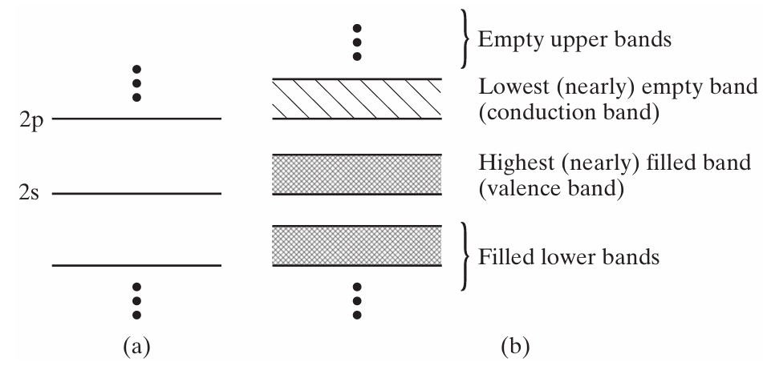
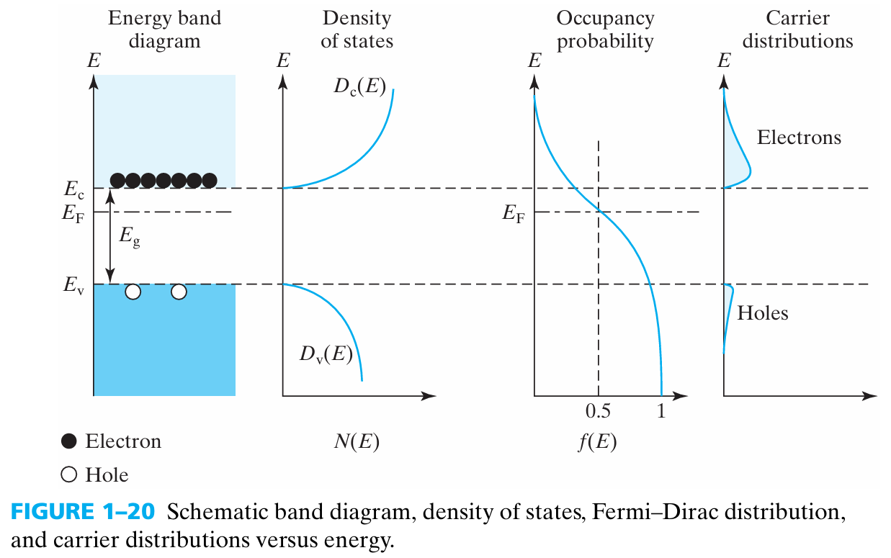
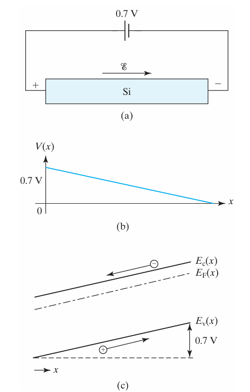
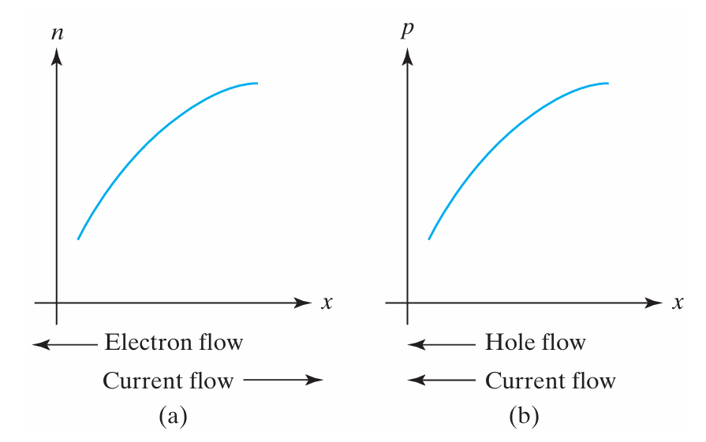

单原子势场中，电子占据discrete energy level;多原子晶体中，因为`泡利不相容原理`，分离的能级会散开成几乎连续的能量范围。这个电子能量的取值范围是由`薛定谔方程`与势函数（`Dirac Comb`和`Kronig-Penney`）计算 $k$ 是否有解确定的。有解的能量范围为允带，无解的是禁带。由于允带内相邻能级的间隙很小，所以我们将这个范围视为连续。连续的意思是，能带内部的每个能量值都有可能被取到/被电子占据。

 
只有**NOT totally filled** 的带才能导电。所以接下来我们重点考虑的是`conduction band`和`valence band`.

Carriers in semiconductor: **electrons** and **holes**. Holes can move from one valence bond to another.

# Density of states
It is useful to think of an energy band as a collection of discrete energy states. In quantum mechanics terms, each state represents a unique spin (up and down) and unique solution to the `Schrodinger’s wave equation` for the periodic electric potential function of the semiconductor. Each state can hold either one electron or none. 
If we count **the number of states in a small range of energy, ∆Ε, in the conduction band**, we can find the `density of states`.
用三维自由电子气态密度（含自旋），推导

**1. k空间量子态数**  
体积 $V$ 中，k 空间态密度为 $\frac{V}{(2\pi)^3}$，含自旋简并度 2：

$$ dN = 2\cdot \frac{V}{(2\pi)^3}   d^3 \mathbf{k} = \frac{V}{4\pi^3}   4\pi k^2 dk = \frac{V}{\pi^2} k^2 dk $$

**2. 能量替换**  
由 $E = \frac{\hbar^2 k^2}{2m}$ 得：

$$ k^2 dk = \frac{\sqrt{2}   m^{3/2}}{\hbar^3} \sqrt{E}   dE $$

**3. 代入即得**

$$ D(E)dE = \frac{V}{\pi^2} \cdot \frac{\sqrt{2}   m^{3/2}}{\hbar^3} \sqrt{E}   dE $$

$$ D(E) = \frac{V}{2\pi^2}   (\frac{2m}{\hbar^2}   )^{3/2}\sqrt{E}$$

**要点**：  
- 正比于 $\sqrt{E}$（三维特征）  
$$ \boxed{g(E)=D(E)/V = \frac{1}{2\pi^2}   (\frac{2m}{\hbar^2}   )^{3/2}\sqrt{E}} $$

# DOS of semiconductor

$$E - E_c = \frac{\hbar^2k^2}{2{m_n}}\qquad E_v - E = \frac{\hbar^2k^2}{2{m_p} }$$

>$$g_c(E)= \frac{1}{2\pi^2}   (\frac{2{m_n}}{\hbar^2}   )^{3/2}\sqrt{E - E_c}$$
>$$g_v(E)= \frac{1}{2\pi^2}   (\frac{2{m_p}}{\hbar^2}   )^{3/2}\sqrt{E_v - E}$$

**为什么自由电子气推导出来的DOS可以到处使用**

笔记暗示了半导体能带结构在能带边缘处，其能量与 $k$ 的关系形式上与自由电子气（$E = \hbar^2k^2/2m$）保持了一致的抛物线形状。这种**数学形式上的相似性**（即 $E \propto k^2$），是笔记能够将自由电子气态密度公式直接移植到半导体中的唯一物理依据。
同时，所有的误差被转移到**有效质量**上

# Fermi-Dirac distribution
> **前提条件**：以下 Fermi–Dirac 分布仅在 **热平衡（Thermal equilibrium）** 下成立。  
> 非平衡态（光照、外加偏压）下，不能直接用此式。

`Fermi-Dirac distribution`是已知态密度公式，在 $E$ 和电荷守恒约束下，用拉格朗日乘数法算出来的，电子在各能级分布的概率最大的情况（最概然分布）

晶体中，电子是无数的，需要考虑多变量波函数。电子分布满足能量守恒和电荷守恒

1. 多电子状况下，电子的分布可以不考虑电子相互作用，利用单电子分布叠加，从而获得最概然分布，即费米分布吗？
>电子形成的势场，微弱，内部自相抵消，数量级远小于晶格势和原子核势，可以忽略。
2. 为什么“随机的单体行为”加在一起，宏观上就必然跑去“最概然分布”？
>参考数学笔记
3. 考虑为叠加，是否违背多变量波函数？
>前面有提到过，用叠加法实际上是去掉耦合项，把多变量波函数分离变量。

## 1. 原始式子
费米-狄拉克分布函数 $f(E)$ 表示能量为 $E$ 的单个量子态被粒子占据的概率：

$$f(E) = \frac{1}{e^{(E - \mu) / (k_B T)} + 1}$$
---
**参数说明：**
*   $E$：该量子态的能量。
*   $\mu$：化学势（在半导体物理中常记为费米能级 $E_F$）。
### metal
>**free electron** ，即势函数是const，平坦

- when $E > \mu$ ,分母指数爆炸， $f(E) \to 0$ 
- when $E < \mu$ ,分母逼近1，$f(E) \to 1$
所以，金属的carrier, namely  **free electron**的分布，可以看成`electron ocean model`,where fermi level is the sea level. Electrons above fermi level are ignorable compared with those underneath.

### semiconductor
>势场更加复杂
1. 导带的载流子 ，即电子可以看作**free electron**
2. 价带的载流子hole，也可看做**free electron**

- when $E > \mu$ ,分母指数爆炸， $f(E) \to 0$ ，导带电子密度远离$E_f$会指数衰减
- when $E < \mu$ ,分母逼近1，$1 - f(E) \to 0$ ，价带空穴密度远离$E_f$也会指数衰减

**上下都少，不能像金属那样忽略**

## 2. 玻尔兹曼近似（Boltzmann Approximation）

当系统满足特定条件（即能量远大于化学势，$(E - \mu) \gg k_B T$）时，分母中的“+1”可以忽略不计。此时，费米分布退化为麦克斯韦-玻尔兹曼分布的形式：

$$f(E) \approx e^{-(E - \mu) / (k_B T)}$$

> **注意**：该近似不仅要求 $(E - \mu) \gg k_BT$，还要求系统处于 **热平衡**，  
> 因为 $\mu$（即 $E_F$）本身是热平衡下的定义量。

## 因果关系
**Thermal equilibruim** 条件下

体系的 `intrinsic physics conditions`: $T$ ,doping, energy band

决定`available electrons and states`

从而决定唯一的 $E_F$, 
$E_F$ 作为参数,决定`Fermi-Dirac distribution`

## $f(E)$ 的性质 without Boltzman approximation
>$T = 0K$ ,所有电子的能量都小于 $E_F$
.
$T \neq 0K$ ,then $f(E_F) = \frac{1}{2}$
.
Mathematically, the **graph** of **$f(E > E_F) $** 与 the **graph** of **$1 - f(E < E_F)$** 关于$E = E_F$对称
.
Under **Thermal equilibrium**, Fermi level is a horizental line, 因为上移和下移的电子一样多

---

# Carrier concentration
## 1. 基本物理量定义

*   **态密度 $g(E)$**：单位能量间隔、单位体积内的量子态数量。
    *   导带：$g_c(E) = \frac{1}{2\pi^2}    ( \frac{2m_n}{\hbar^2}    )^{3/2} \sqrt{E - E_c} \quad (E \ge E_c)$
    *   价带：$g_v(E) = \frac{1}{2\pi^2}    ( \frac{2m_p}{\hbar^2}    )^{3/2} \sqrt{E_v - E} \quad (E \le E_v)$
*   **费米分布 $f(E)$**：
    *   电子占据概率：$f(E) = \frac{1}{1 + e^{(E-E_F)/k_BT}}$
    *   空穴占据概率：$1 - f(E) = \frac{1}{1 + e^{(E_F-E)/k_BT}}$

## 2. 积分公式

电子浓度 $n$ 和空穴浓度 $p$ 分别为：

$$n = \int_{E_c}^{\infty} g_c(E) f(E) dE\qquad p = \int_{-\infty}^{E_v} g_v(E) [1 - f(E)] dE$$

## 3. 使用玻尔兹曼近似计算

在非简并半导体中，通常满足 $(E_c - E_F) \gg k_B T$（对于电子）和 $(E_F - E_v) \gg k_B T$（对于空穴）。此时可以使用玻尔兹曼近似：
$f(E) \approx e^{-(E-E_F)/k_BT}$

### (1) 计算电子浓度 $n$
将 $g_c(E)$ 和近似后的 $f(E)$ 代入：
$$n \approx \int_{E_c}^{\infty}    [ \frac{1}{2\pi^2}    ( \frac{2m_n}{\hbar^2}    )^{3/2} \sqrt{E - E_c}    ] e^{-(E-E_F)/k_BT} dE$$

令 $x = \frac{E-E_c}{k_BT}$，经过积分运算（利用 $\int_0^\infty \sqrt{x} e^{-x} dx = \frac{\sqrt{\pi}}{2}$），得到：

$$\boxed{n = N_c e^{-(E_c - E_F)/k_BT}}$$

其中，$N_c = 2    ( \frac{m_n k_B T}{2\pi \hbar^2}    )^{3/2}$ 是**effective density of states of conduction band**

### (2) 计算空穴浓度 $p$
同理，将 $g_v(E)$ 和近似后的 $[1 - f(E)]$ 代入积分：

$$\boxed{p = N_v e^{-(E_F - E_v)/k_BT}}$$

其中，$N_v = 2    ( \frac{m_p k_B T}{2\pi \hbar^2}    )^{3/2}$ 是**effective density of states of valence band**

### (3) 浓度乘积

通过上述结果，可以看到电子浓度和空穴浓度的乘积与费米能级 $E_F$ 无关：

$$n \cdot p = N_c N_v e^{-(E_c - E_v)/k_BT} = N_c N_v e^{-E_g/k_BT}$$

由于本征半导体中 $n = p = n_i$，$n_i$ is defined **equilibrium intrinsic carrier concentration**.
$$\boxed{n \cdot p = n_i^2}$$

> **Warning**: all the boxed equations are derived under:
> 1. **Thermal equilibrium** (most important)
> 2. **Boltzmann approximation** (non-degenerate semiconductor)
> 若偏离上述条件，$n \cdot p = n_i^2$ 不成立。

## 价带顶和导带底

在Boltzman 近似下
As if all the conduction band were effectively squeezed into a single energy level, $E_c$
$$\boxed{n = N_c e^{-(E_c - E_F)/k_BT}}$$

所以，$N_c = 2    ( \frac{m_n k_B T}{2\pi \hbar^2}    )^{3/2}$ 是**effective density of states of conduction band**，指的是用导带底的能级代替浓度积分来近似计算。

---
# Relation btw `Energy diagram` and $V(x) , \mathcal{E}$

band 都是electron的band, 所以讲的都是electron的能量。
>为什么施加电场，导致band弯曲？
因为electron在原地被改变能量了。而且电势高的地方，electron的能量变低。

---
# Donor and accepter
**Doping** 是在intrinsic里面参杂`donor`和`accepter`，最终引入施主能级 $E_d$ 和受主能级 $E_a$ ,每个施主能级有两个量子态

## Ionization

| | **Donor（施主）** | **Accepter（受主）** |
| :---: | :--- | :--- |
| **电离定义** | 激发多余电子进**导带** | 价带电子填充受主，产生**空穴** |
| **result** | $D^+ +$ electron | $A^- +$ hole |
| **complete ionization** | $n \approx N_d$ | $p \approx N_a$ |
| **未电离的状态** | 多余电子仍占据施主能级 | 受主能级未被电子填充 |
| **未电离概率公式** | $f(E_D)=\frac{1}{1+e^{(E_D-E_F)/kT}}$ | $1-f(E_A)=\frac{1}{1+e^{(E_A-E_F)/kT}}$ |
| **公式的物理含义** | = 被电子占据的概率 | = 未被电子填充的概率 |

## Two principles
| | **电中性条件（Charge Neutrality）** | **np 乘积平衡（Mass Action Law）** |
| :---: | :--- | :--- |
| **公式** | $p + N_d^+ = n + N_a^-$ | $n \cdot p = n_i^2$ |
| **物理含义** | 半导体内部总正电荷 = 总负电荷（无净电荷积累） | 平衡状态下，电子浓度 × 空穴浓度 = 常数（仅与温度有关） |
| **适用范围** | 热平衡 + 非平衡（只要稳态） | **仅限热平衡状态** |
| **N型（$N_d \gg N_a$）简化** | $n \approx N_d - N_a$（若 $n \gg p$） | $p = \dfrac{n_i^2}{n} \approx \dfrac{n_i^2}{N_d - N_a}$ |
| **P型（$N_a \gg N_d$）简化** | $p \approx N_a - N_d$（若 $p \gg n$） | $n = \dfrac{n_i^2}{p} \approx \dfrac{n_i^2}{N_a - N_d}$ |

---

## 计算Fermi level
> 1. 使用电荷守恒
> 2. non-degenerated条件 ,即参杂浓度不高
费米能级 $E_f$ 必须满足以下条件：
**对于电子（n型）**：$E_c - E_f \ge 3k_B T$
**对于空穴（p型）**：$E_f - E_v \ge 3k_B T$
这样才能使得**Boltzman approximation**成立

### intrinsic

在本征（无掺杂、无缺陷）半导体中，导带中的电子浓度 $n_0$ 必须等于价带中的空穴浓度 $p_0$

根据非简并半导体的统计分布，导带电子浓度 $n_0$ 和价带空穴浓度 $p_0$ 分别表示为：
$$n_0 = N_c \exp   (-\frac{E_c - E_f}{k_B T}   )\qquad p_0 = N_v \exp   (-\frac{E_f - E_v}{k_B T}   )$$

*   $N_c$ 和 $N_v$ 分别为导带和价带的有效状态密度。

将 $n_0 = p_0$ 代入上述公式中：
$$N_c \exp   (-\frac{E_c - E_{fi}}{k_B T}   ) = N_v \exp   (-\frac{E_{fi} - E_v}{k_B T}   )$$

整理得到本征费米能级 $E_{fi}$ 的表达式：
$$E_{fi} = \frac{E_c + E_v}{2} + \frac{1}{2} k_B T \ln   (\frac{N_v}{N_c}   )$$

引入有效质量的表达形式
导带和价带的有效状态密度 $N_c$ 和 $N_v$ 与电子和空穴的有效质量 $m_e$、$m_h$ 存在如下关系：
$$N_c = 2    ( \frac{2\pi m_e k_B T}{h^2}    )^{3/2} \qquad N_v = 2    ( \frac{2\pi m_h k_B T}{h^2}    )^{3/2}$$

因此，两者的比值为：
$$\frac{N_v}{N_c} =    ( \frac{m_h}{m_e}    )^{3/2}$$

将此比值代入 $E_{fi}$ 的计算公式中，可得：
$$E_{fi} = \frac{E_c + E_v}{2} + \frac{3}{4} k_B T \ln   (\frac{m_h}{m_e}   )$$

可以得出以下物理结论：
>1.  **在绝对零度时（$T = 0\text{ K}$）：**
    本征费米能级严格位于禁带的中点（禁带中央）。
>2.  **在实际温度下（$T > 0\text{ K}$）：**
    由于大多数半导体中空穴的有效质量大于电子的有效质量（即 $m_h > m_e$），第二项为正值。这意味着随着温度升高，本征费米能级会从禁带中央往上（向导带方向）产生轻微的偏移。但在室温下，由于 $k_B T$ 较小（约 $0.0259\text{ eV}$），这一偏移量通常非常微小，在粗略计算中仍常近似认为本征费米能级位于禁带中央。

### N type
$$N_c \exp   (-\frac{E_c - E_f}{k_B T}   ) = n = N_d$$

### Summary
| 半导体类型 | 费米能级公式（相对于 $E_{fi}$） | 费米能级位置特征 |
| :--- | :--- | :--- |
| **本征半导体** | $E_{fi} \approx \frac{E_c + E_v}{2}$ | 接近禁带中央 |
| **n型半导体** | $E_{fn} = E_{fi} + k_B T \ln   (\frac{N_d}{n_i}   )$ | 偏向导带（禁带上半部分） |
| **p型半导体** | $E_{fp} = E_{fi} - k_B T \ln   (\frac{N_a}{n_i}   )$ | 偏向价带（禁带下半部分） |

*注：上述公式适用于非简并半导体（即掺杂浓度没有达到极高水平，费米能级仍距离导带底或价带顶大于 $3k_B T$ 的情况）*

---

# Motion and Recombination
These are the behaviours of electrons and holes.
> **Equilibrium states check:**
> - **Thermal equilibrium** $np = n_i^2 \qquad \vec{J}_{total} = 0$ 只有随机热运动，无定向净电流。
> - **Near-equilibrium** $np \approx n_i^2 \qquad \vec{J}_{total} \neq 0$ **Drift** 与 **Diffusion** 过程。
> - **Non-equilibrium** $np \neq n_i^2$ **Generation** 与 **Recombination**（产生/消灭过剩载流子）。
## motion

### Thermal motion

即使在无外加电场时，载流子也在做随机热运动。

平均热动能：$$ \langle E_k \rangle = \frac{3}{2}kT, \quad \frac{1}{2}mv_{th}^2 = \frac{3}{2}kT $$

$$ v_{th} = \sqrt{\frac{3kT}{m}} $$

> 300 K, Si: $v_{th} \approx 2.3\times10^7  \text{cm/s}$

两次collision or scattering之间的平均时间为 mean free time $\tau$，室温 Si 中约 $10^{-12}$ 到 $10^{-13}  \text{s}$。

mean free path $$ \lambda = v_{th}\tau $$

热运动方向随机，net thermal velocity为零, 所以无steady current $$ \langle\vec{v}_{th}\rangle = 0 $$

> 外加电场后，叠加定向漂移速度 $v_d$，但 $v_d \ll v_{th}$。

### Drift

加电场 $\mathcal{E}$ 后，载流子受到电场力：$$ \vec{F} = q\vec{\mathcal{E}} $$

在两次散射之间，载流子被电场加速，获得一个定向的漂移速度。

电子 ($q = -e$)：$$ \vec{v}_{dn} = -\frac{e\tau}{m_n}\vec{\mathcal{E}} $$

空穴 ($q = +e$)：$$ \vec{v}_{dp} = \frac{e\tau}{m_p}\vec{\mathcal{E}} $$

定义迁移率 (mobility) $$ \mu = \frac{e\tau}{m} $$

则 
$$ \vec{v}_d = \mu \vec{\mathcal{E}} $$ 
空穴沿电场方向，电子反向

> 迁移率反映载流子对电场的响应快慢，Si中室温下电子 $\mu_n \approx 1350  \text{cm}^2/(\text{V·s})$，空穴 $\mu_p \approx 480  \text{cm}^2/(\text{V·s})$。

漂移电流密度
$$ \vec{J}_{drift} = q n \vec{v}_d + q p \vec{v}_d $$

总漂移电流：$$ \vec{J}_{drift} = q(n\mu_n + p\mu_p)\vec{\mathcal{E}} $$

定义电导率 (conductivity) $$ \sigma = q(n\mu_n + p\mu_p) $$

则 $$ \vec{J}_{drift} = \sigma \vec{\mathcal{E}} $$ 

### scattering mechanism

根据马西森定则（Matthiessen's Rule），总迁移率满足：

$$\frac{1}{\mu} = \frac{1}{\mu_{\text{phonon}}} + \frac{1}{\mu_{\text{impurity}}}$$

|  | Phonon Scattering | Ionized Impurity Scattering |
| :--- | :--- | :--- |
| **物理机制** | 载流子与因温度引起的热振动晶格（声子）发生碰撞。 | 载流子与电离的donor/accepter ion之间的库仑力作用 |
| **温度依赖关系** | $\mu_{\text{phonon}} \propto T^{-3/2}$ （或 $T^{-r}$，其中 $r$ 通常在 $1.5 \sim 2.5$ 之间） | $\mu_{\text{impurity}} \propto T^{3/2}$ |
| **随温度变化趋势** | **温度升高，迁移率降低**。 | **温度升高，迁移率升高**。 |
| **升温的物理影响** | 晶格热振动加剧，声子数量和碰撞截面增大，导致散射概率增加，$\tau$变短。 | 载流子的平均热运动速度加快，经过电离杂质附近的时间变短，受库仑力偏转的效果减弱。 |
| **掺杂浓度的影响** | 对掺杂浓度不敏感。 | 极度依赖掺杂浓度：掺杂浓度（$N_I$）越高，电离杂质散射越强，$\mu_{\text{impurity}} \propto \frac{1}{N_I}$。 |
| **主导的温度区间** | **高温区**（通常在室温及以上，晶格振动占主导）。 | **低温区**（此时晶格振动微弱，库仑散射占主导）。 |

> 1. **低温区（电离杂质散射主导）**：
   随着温度 $T$ 升高，迁移率 $\mu$ 随 $T^{3/2}$ 规律**上升**。
>2. **高温区（声子散射主导）**：
   随着温度 $T$ 进一步升高，迁移率 $\mu$ 随 $T^{-3/2}$ 规律**下降**。
>3. **峰值位置**：
   迁移率在某个中间温度达到最大值。掺杂浓度越高，电离杂质散射越强，整个迁移率曲线会整体下移，且最大值对应的温度点会向高温方向移动。

### Diffusion

载流子从高浓度区域向低浓度区域扩散。

扩散粒子流密度 (Fick's first law)：

电子：$$ \vec{F}_n = -D_n \nabla n $$

空穴：$$ \vec{F}_p = -D_p \nabla p $$

乘以电荷得到扩散电流密度：

$$ \vec{J}\_{n,diff} = q D_n \nabla n \qquad \vec{J}\_{p,diff} = -q D_p \nabla p $$

> 电子带负电，流向浓度增加方向(∇n指向高浓度)，则电流方向与之相反，所以电子扩散电流沿∇n方向为正，公式为正号；空穴带正电，所以空穴扩散电流沿∇p方向为负，公式为负号。这个符号容易搞混，推导时检查一下。
其中 $D_n$ 和 $D_p$ 是扩散系数 `diffusion coefficient`

### Einstein relation 
连接迁移率和扩散系数：

$$ \frac{D}{\mu} = \frac{kT}{q} $$
> 这个关系在热平衡下成立，但通常也用于非平衡作为近似。为什么会有这个关系？因为扩散系数和迁移率本质上反映的是`drift`和`diffusion`所收到的阻碍。而在晶体中，阻碍大部分来自晶格的scattering mechanism

### Total current density
总电流密度 = 漂移 + 扩散：

$$ \vec{J}_n = q n \mu_n \vec{\mathcal{E}} + q D_n \nabla n $$

$$ \vec{J}_p = q p \mu_p \vec{\mathcal{E}} - q D_p \nabla p $$

$$ \vec{J}_{total} = \vec{J}_n + \vec{J}_p $$

## Excess Carriers, Generation & Recombination

- **Thermal Equilibrium**: $n_0, p_0 \implies n_0 p_0 = n_i^2$
- **Non-Equilibrium** (光照等外加激发): $n = n_0 + n' \qquad p = p_0 + p'$
> 因为成对产生，所以过剩载流子浓度满足 $n' \equiv p'$。

### Generation
- **Thermal generation**: 速率为 $G_0$（热激发）。
- **Photo generation**: 速率为 $G_L$（光激发，产生电子-空穴对）。
- **Total generation rate**: $G = G_0 + G_L$

### Recombination
关灯后 ($G_L = 0$)，过剩载流子随时间衰减 (decay)。

- **Carrier lifetime $\tau$**: 衰减时间常数（过剩载流子寿命）。
- **Recombination rate equation**:
  $$ \frac{dn'}{dt} = -\frac{n'}{\tau} = -\frac{p'}{\tau} $$
- **Decay solution**: 
  $$ n'(t) = n'(0) e^{-t/\tau} $$

> **适用条件**
> 以上指数衰减公式仅在**小注入条件 `Low-level injection`** 下成立。
> - 例（p型半导体）：$n' \ll p_0$（过剩少子浓度远小于平衡多子浓度）。此时少子寿命 $\tau_n$ 可近似为常数。

| 概念 | 物理含义 | 发生的物理状态 | 核心数学表达式 | 决定因素 |
| --- | --- | --- | --- | --- |
| **完全电离** `Complete Ionization` | 杂质原子**100%释放了载流子** | **热平衡状态**（或接近平衡） | $n_0 \approx N_D$ (N型) $p_0 \approx N_A$ (P型) | 温度（室温下硅/锗基本完全电离）、杂质能级深度 |
| **小注入条件** `Low Injection Condition` | 外界激励产生的**过剩载流子浓度**远小于平衡时的**多子浓度**| **非平衡状态**（有光照/加电压） | $\Delta n = \Delta p \ll n_0$ (N型) $\Delta n = \Delta p \ll p_0$ (P型) | 外界激励强度（光照强弱、偏压大小） |

